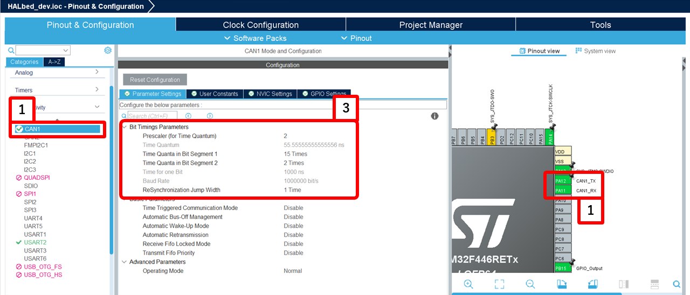
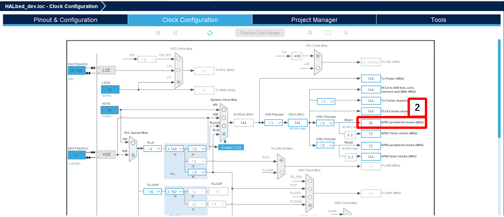
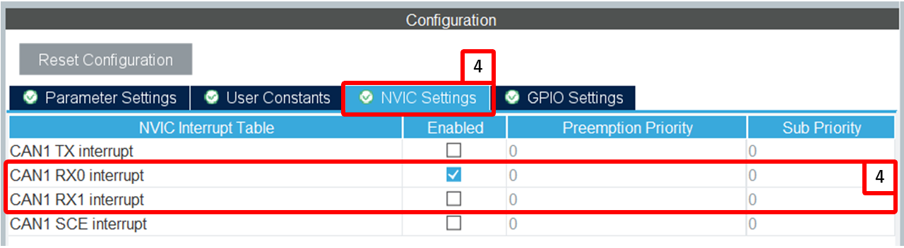

# CAN

## 概要
このライブラリは、HAL を利用した、CAN通信を簡単に扱うためのクラスを提供する

---

## クラス概要
### `CAN`
CANクラスは、CAN通信の初期化、フィルタ設定、メッセージ送信、受信コールバックの設定を行う

#### コンストラクタ
```cpp
CAN(CanHandleType *CanHandle);
```
- `CanHandle` : HALによって生成されたCANハンドラへのポインタ

> [!caution]
> f303k8などの一部のマイコンでは、HALライブラリと干渉するため、
> ```cpp
> CANAlt(CAN_HandleTypeDef *CanHandle);
> ```
> のように、CANAltクラスを使用する必要がある。
> f303k8以外のマイコンを使用している場合でかつ、干渉によってビルドエラーが発生する場合、CANAltクラスを使用するようインクルードガードを編集してください。

#### メソッド

##### `void init()`
CANの初期化を行う

---

##### `void filterSetup(uint32_t filter_id, uint32_t filter_mask, uint8_t is_extended, uint8_t fifo)`
CANフィルタの設定を行う
> - `filter_id` : フィルタID
> - `filter_mask` : フィルタマスク
> - `is_extended` : 拡張IDかどうか
> - `fifo` : FIFO番号 (0 または 1)

> [!Note]
> この関数は HAL_CAN_ConfigFilter を内部で使用する
> CubeMX 側で FIFO 割り込みが有効になっている必要がある

---

##### `void filterSetupWithConfig(const CAN_FilterTypeDef &FilterConfig)`
CANフィルタの設定を行う (CAN_FilterTypeDefを引数として受け取る)
> - `FilterConfig` : CANフィルタ設定構造体

---

##### `bool write(CANMessageType msg)`
CANメッセージの送信を行う
> - `msg` : 送信するCANメッセージ
> - `true` : 送信成功
> - `false` : 送信失敗

---

##### `bool writeable()`
CAN送信が可能かどうかを確認
> - `true` : 送信可能
> - `false` : 送信不可

---

##### `void attach(std::function<CallbackFnType> &&fn, uint8_t priority = 100, uint8_t fifo = 0)`
コールバック関数を設定
> - `fn` : コールバック関数
> - `priority` : コールバックの優先度
> - `fifo` : FIFO番号 (0 または 1)

---

## 使用方法

### CubeMX の設定
1. **使用するピンを設定**
   
    
2. **クロック設定を確認する**
   - CubeMXのClock ConfigurationでCANのクロック源のAPB1の周波数を確認する
    
3. **CANの転送速度とサンプリングポイントを設定**
   - (2.)で確認したクロック設定と、ボーレート&サンプリングポイントを設定する
4. **受信割り込みの設定をする**
    - FIFOを有効化し、受信割り込みの設定を行います
    - FIFO0 : `CANx RX0 interrupts`
    - FIFO1 : `CANx RX1 interrupts`  
    

> [!Note]
> 画像は 'STM23 F446re' を使用し、`1Mbps` ,サンプリングポイント `88.9%` で計算 </br>
> 各パラメータは [CAN Bit Time Calculation](http://www.bittiming.can-wiki.info/) などのWEBツールを使用して計算できる </br>
> 多くの場合、サンプリングポイントは 75% 以上にすることが推奨されている </br>


### app_main.cpp内 
1. `CAN`クラスのインスタンスを作成
   ```cpp
   CAN can(&hcan1);
   ```
   
2. 必要に応じて初期化
   ```cpp
   can.init();
   ```

3. フィルタIDとマスクを設定
   ```cpp
   can.filterSetup(filter_id, filter_mask, is_extended, fifo);
   ```

4. コールバック関数を設定
   ```cpp
   can.attach(callback_function, priority, fifo);
   ```

5. メッセージを送信
   ```cpp
   if (can.writeable()) {
       CANMessage msg;
       msg.id = 0x123;
       msg.data[0] = 1;
       msg.data[1] = 2;
       msg.data[2] = 3;
       msg.data[3] = 4;
       msg.size = 4;
       can.write(msg);
   }
   ```

---

## 注意事項
- 割り込み処理内での長時間の処理やブロッキング処理は避ける

---

## サンプルコード

### 動作

1. プログラム開始時に、UARTを通じて以下のメッセージが表示されます。
    ```
    Start main
    ```

2. CANメッセージが送信されるたびに、以下のメッセージが表示されます。
    ```
    send done
    ```

3. CANメッセージを受信すると、LEDがトグルされ、UARTを通じて以下のメッセージが表示されます。
    ```
    Received CAN message: ID = 0x123, Data = 01 02 03 04
    ```
---

```cpp
#include "main.h"
#include "../../Library/HALbed/Inc/HALbed.hpp"

using namespace HALbed;

extern UART_HandleTypeDef huart2; // 外部宣言
extern CAN_HandleTypeDef hcan1;

UART pc(&huart2);
CAN can(&hcan1);

void canListen_main(const CANMessage &msg);

extern "C" void app_main(void) {
    pc.enableRxInt();               // 受信割り込みを有効にする
    // コールバック関数を設定
    can.attach([](const CANMessage &msg) { canListen_main(msg); }, 0);
    can.init();                     // CANをスタートする

    uint32_t filter_id = 0x000;     // 0xXXX のID
    uint32_t filter_mask = 0x000;   // 0xXXX で共通するビット（上位4ビットだけを比較）

    // フィルタIDとマスクを設定
    can.filterSetup(filter_id, filter_mask, 0, 0);
    pc.xprintf("Start main\r\n");

    while (1) {
        if (can.writeable()) {      // CAN busに書き込み可能か
            CANMessage msg;         // 送信するデータを設定
            msg.id = 0x123;
            msg.data[0] = 1;
            msg.data[1] = 2;
            msg.data[2] = 3;
            msg.data[3] = 4;
            msg.size = 4;
            if(can.write(msg)){
                pc.xprintf("send done\r\n");    // 正常に送信できたら出力
            }
        }
        HAL_Delay(500);
    }
}

void canListen_main(const CANMessage &msg) {
      HAL_GPIO_TogglePin(LED_GPIO_Port, LED_Pin);
     pc.xprintf("Received CAN message: ID = 0x%X, Data = ", msg.id);
     for (int i = 0; i < msg.size; i++) {
         pc.xprintf("%02X ", msg.data[i]);
     }
     pc.xprintf("\r\n");
}
```
