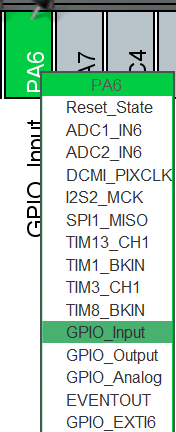

# DigitalIn

## 概要
DigitalInクラスは、GPIOポートとピン番号からデジタル入力を実現します。入力状態の読み取りと、割込み用のコールバック設定が可能です。

---

## クラス概要
### `DigitalIn`
DigitalInクラスは、GPIOピンの状態を読み取り、必要に応じて割込み処理を委譲する機能を持ちます。

#### コンストラクタ
```cpp
DigitalIn(GPIO_TypeDef* port, uint16_t pin);
```
- port : 使用するGPIOポート
- pin  : ピン

または

```cpp
DigitalIn(PinName pin);
```
- 自動的にポートとビットマスクが設定される

#### メソッド

##### `int read()`
GPIOの状態を読み取る（HAL_GPIO_ReadPinを利用）
> - GPIO の状態（0 または 1）

---

##### `operator int()`
read()と同等の結果を返す
> - GPIO の状態（0 または 1）

---

##### `void attach(CallbackFnType fn, uint8_t priority = 100)`
指定ピンに対し、割込み処理のコールバックを設定
> - `fn` : 実行するコールバック関数
> - `priority` : 割込み優先度（デフォルトは100）

---

##### `GPIO_TypeDef* get_port()`
使用しているGPIOポートを返す
> - GPIO ポート

---

##### `uint16_t get_pin()`
使用しているピン番号を返す
> - ピン番号

---

## 使用方法
### CubeMXの設定 
> [!Caution] 注意点
> CubeMXの設定は各シリーズや使用するピンによって異なる場合があります。
> 各シリーズのリファレンスマニュアル等を参照してください。

#### (PortとPinを指定する場合)
ピンの設定を行う。


> [!Warning] 割り込み処理を実行する場合
> EXTI line[15:10] interrupts の Enabled にチェックを入れて割り込みを許可


> [!Note]
> `GPIO` タブの `GPIO mode` が `External Interruput Mode with Falling edge trigger detection` になっていることを確認してください。<br>
> `H` ->`L` になることを検出する場合は `Falling edge` 
> 必要に応じて適切に設定してください。

### cppmain.cpp内
1. DigitalInクラスのインスタンスを生成します
   ```cpp
   HALbed::DigitalIn btn(GPIOA, GPIO_PIN_0);
   ```

2. 入力状態の取得
   ```cpp
   if(btn.read()) {
       // 入力が立っている場合の処理
   }
   ```

3. 割込み設定
   ```cpp
   btn.attach([](){
       // 割込み発生時の処理
   });
   ```

---
## 注意事項
> [!caution]
> 割り込み処理の場合CubeMXの設定が異なります。
> 正しく動作しない場合設定を再確認してください。

---

## サンプルコード
ボタンが押されたときにLEDを点灯します。
```cpp
#include "main.h"
#include "../../Library/HALbed/Inc/HALbed.hpp"

using namespace HALbed;
DigitalOut LED(PB_2);
DigitalIn  btn(PC_13);
// DigitalOut LED(LED_GPIO_Port, LED_Pin);  //CubeMXで設定した場合
// DigitalIn  btn(GPIOA, GPIO_PIN_1);
bool btn_value=0;

extern "C" void cppmain(void)
{
	while(true){
		btn_value = btn.read();
		LED.write(!btn_value);
    }
}
```