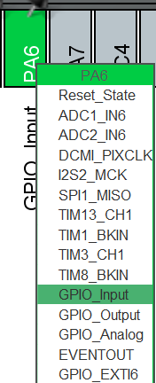
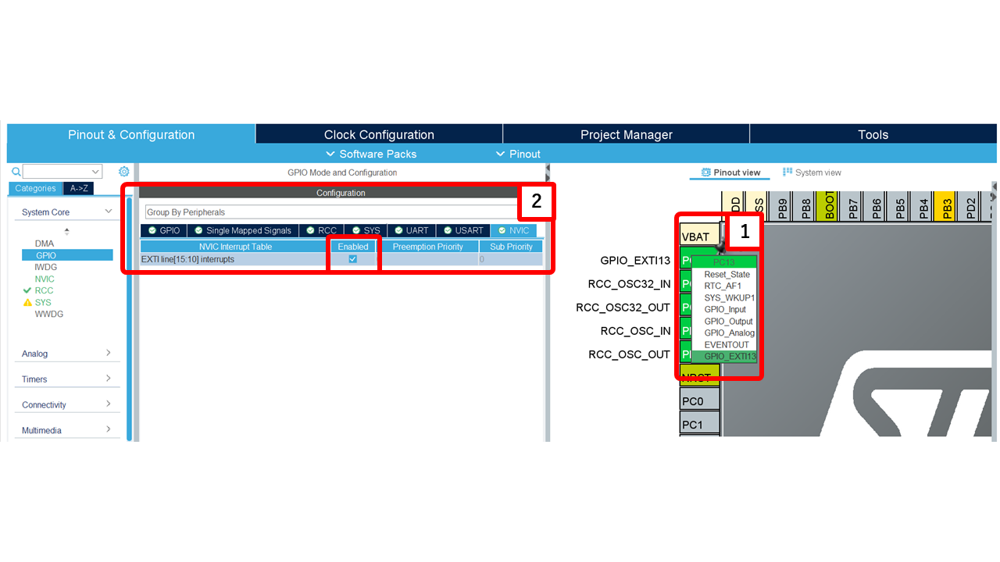

# DigitalIn

## 概要
DigitalInクラスは、GPIOポートとピン番号からデジタル入力を実現します。入力状態の読み取りと、割込み用のコールバック設定が可能です。

---

## クラス概要
### `DigitalIn`
DigitalInクラスは、GPIOピンの状態を読み取り、必要に応じて割込み処理を委譲する機能を持ちます。

#### コンストラクタ
```cpp
DigitalIn(GPIO_TypeDef* port, uint16_t pin);
```
- port : 使用するGPIOポート
- pin  : ピン

または

```cpp
DigitalIn(PinName pin);
```
- 自動的にポートとビットマスクが設定される

#### メソッド

##### `int read()`
GPIOの状態を読み取る（HAL_GPIO_ReadPinを利用）
> - GPIO の状態（0 または 1）

---

##### `operator int()`
read()と同等の結果を返す
> - GPIO の状態（0 または 1）

---

##### `void attach(CallbackFnType fn, uint8_t priority = 100)`
指定ピンに対し、割込み処理のコールバックを設定
> - `fn` : 実行するコールバック関数
> - `priority` : 割込み優先度（デフォルトは100）

#### `HALBED_MANUAL_GPIO_CB` を使う場合

通常はHALbedが `HAL_GPIO_EXTI_Callback()` を提供します。アプリケーション側でGPIO外部割り込みを管理する場合は、アプリケーションターゲットに `HALBED_MANUAL_GPIO_CB` を定義してください。アプリケーション側のHALコールバックから、割り込みが発生したピンに対応する登録済みコールバックを呼び出します。

このマクロを定義した場合、HALbed側の自動コールバックはコンパイルされません。アプリケーション側とHALbed側の両方で `HAL_GPIO_EXTI_Callback()` を定義すると、リンク時に多重定義になります。

---

##### `GPIO_TypeDef* get_port()`
使用しているGPIOポートを返す
> - GPIO ポート

---

##### `uint16_t get_pin()`
使用しているピン番号を返す
> - ピン番号

---

## 使用方法

## 外部割り込みの仕組み

GPIO外部割り込みは、STM32のIRQHandlerから `HAL_GPIO_EXTI_Callback()` を経由して、対象ピンに `attach()` で登録した関数へ通知されます。通常はHALbedがHALコールバックを実装するため、アプリケーション側で同名の関数を定義する必要はありません。

アプリケーション側でHALコールバックを管理する場合は、`HALBED_MANUAL_GPIO_CB` をアプリケーションターゲットに定義し、`HAL_GPIO_EXTI_Callback()` から登録したピンに対応する `HALbed::callback::callback()` を呼び出します。アプリケーション側とHALbed側の両方で同じHALコールバックを定義すると、リンク時に多重定義になります。

### CubeMXの設定
> [!Caution] 注意点
> CubeMXの設定は各シリーズや使用するピンによって異なる場合があります。
> 各シリーズのリファレンスマニュアル等を参照してください。

#### (PortとPinを指定する場合)
ピンの設定を行う。


> [!Warning] 割り込み処理を実行する場合
> EXTI line[15:10] interrupts の Enabled にチェックを入れて割り込みを許可



> [!Note]
> `GPIO` タブの `GPIO mode` が `External Interruput Mode with Falling edge trigger detection` になっていることを確認してください。<br>
> `H` ->`L` になることを検出する場合は `Falling edge` 
> 必要に応じて適切に設定してください。

### app_main.cpp内
1. DigitalInクラスのインスタンスを生成します
   ```cpp
   HALbed::DigitalIn btn(GPIOA, GPIO_PIN_0);
   ```

2. 入力状態の取得
   ```cpp
   if(btn.read()) {
       // 入力が立っている場合の処理
   }
   ```

3. 割込み設定
   ```cpp
   btn.attach([](){
       // 割込み発生時の処理
   });
   ```

---
## 注意事項
> [!caution]
> 割り込み処理の場合CubeMXの設定が異なります。
> 正しく動作しない場合設定を再確認してください。
> `attach()` のコールバックは割り込みコンテキストから呼ばれるため、長時間の待ち処理やブロッキング処理を避けてください。

---

## サンプルコード
ボタンが押されたときにLEDを点灯します。
```cpp
#include "main.h"
#include "../../Library/HALbed/Inc/HALbed.hpp"

using namespace HALbed;
DigitalOut LED(PA_5);
DigitalIn  btn(PC_13);


extern "C" void app_main(void) {
    while (1)
    {
        if(btn.read()){
            LED.write(1);
        }else{
            LED.write(0);
        }
    }
}
```
