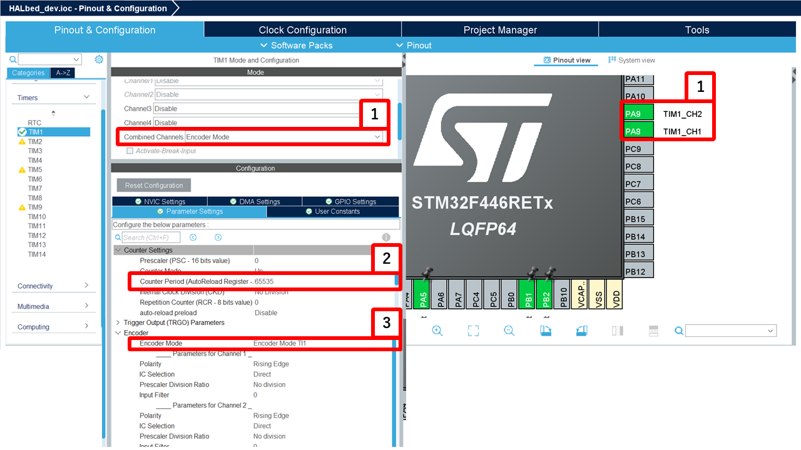

# Encoder

## 概要
このライブラリは、エンコーダを操作するためのC++クラスを提供します。エンコーダのカウント、角度、回転速度などを簡単に取得できます。

---

## クラス概要
### `Encoder`
Encoderクラスは、エンコーダの初期化およびデータ取得機能を提供します。

#### コンストラクタ
```cpp
Encoder(TIM_HandleTypeDef *Timer, unsigned char count_mode, unsigned int period, unsigned int pulsePerRevolution);
Encoder(TIM_HandleTypeDef *Timer, unsigned int pulsePerRevolution);
```
> - `Timer` : タイマーハンドル
> - `count_mode` : カウントモード
> - `period` : カウンタの周期
> - `pulsePerRevolution` : 1回転あたりのパルス数

#### メソッド

##### `bool start()`
エンコーダーのカウントを開始
> - `true` : 成功
> - `false` : 失敗

---

##### `void stop()`
エンコーダーのカウントを停止

---

##### `void setPeriod(unsigned int period)`
カウンタの周期を設定
> - `period` : カウンタの周期

---

##### `void setPulsePerRevolution(unsigned int ppr)`
1回転あたりのパルス数を設定
> - `ppr` : パルス数

---

##### `void setMode(unsigned char mode)`
カウントモードを設定
> - `mode` : カウントモード

---

##### `void setTimer(TIM_HandleTypeDef *Timer)`
タイマーを設定
> - `Timer` : タイマーハンドル

---

##### `int getDirection()`
回転方向を取得
> - `-1` : 逆回転
> - `1` : 順回転

---

##### `int getPulses()`
カウント値を取得
> - カウント値

---

##### `float getRPM()`
RPM（毎分回転数）を取得
> - RPM（毎分回転数）

---

##### `float getRPS()`
RPS（毎秒回転数）を取得
> - RPS（毎秒回転数）

---

##### `float getAngleRad()`
角度をラジアンで取得
> - 角度（ラジアン）

---

##### `float getAngleDeg()`
角度を度で取得
> - 角度（度）

---

##### `float getAngularVelocityRad()`
角速度をラジアン毎秒で取得
> - 角速度（ラジアン/秒）

---

##### `float getAngularVelocityDeg()`
角速度を度毎秒で取得
> - 角速度（度/秒）

---

##### `void resetPulse()`
パルスをリセット

---

## 使用方法
### CubeMXの設定
 
1. `Combined Channels` を `Encoder Mode`に設定し、ピンへの機能わりあてをします。
2. Counter Period : `65535` に設定します
3. Encoder Mode : `Encoder Mode TI1` や`Encoder Mode TI1 and TI2`などに設定します

### Encoder Mode の違い
#### Encoder Mode TI1 (TI2)
- **TI1 のみ**を使用
- TI1のエッジでカウント、方向はTI2の状態で決定
- **低分解能・ノイズ耐性が高い**
- シンプルな設定向き

#### Encoder Mode TI1 and TI2
- **TI1・TI2 両方**を使用
- 両方のエッジでカウントし、方向は位相関係で決定
- **高分解能（4倍）・ノイズによる誤カウントリスクあり**
- 精密な位置制御向き

#### 比較表

| モード | 使用信号 | カウント方式 | 分解能 | ノイズ耐性 |
|--------|--------|-------------|--------|-----------|
| **TI1** | TI1のみ | TI1のエッジのみ | 低い | 高い |
| **TI1 and TI2** | TI1・TI2 | 両方のエッジ | 高い（4倍） | 低い |

---

### app_main.cpp内
1. `Encoder`クラスのインスタンスを作成します
   ```cpp
   Encoder encoder(&htim1, 4096);
   ```
   
2. エンコーダーのカウントを開始します
   ```cpp
   encoder.start();
   ```

3. 必要に応じてデータを取得します
   ```cpp
   int pulses = encoder.getPulses();
   float angle = encoder.getAngleDeg();
   int direction = encoder.getDirection();
   float rpm = encoder.getRPM();
   float rps = encoder.getRPS();
   float angularVelocity = encoder.getAngularVelocityDeg();
   ```

---

## 注意事項
- エンコーダの設定は適切に行ってください
> [!caution]
> このライブラリは値を取得するタイミングで、TIMのカウントをリセットしています。
> 定期的に値を取得し、TIMのカウントをリセットしないとTIMのカウントがオーバーフローしてしまいます。
> 回転数が非常に高い場合などは、タイマー割り込みを使って定期的に `.get~` を呼び出すか、分解能を下げてください。


---

## サンプルコード
以下は、このライブラリを使用したサンプルコードです (AMT102 を使用)。

### `app_main.cpp`
```cpp
#include "main.h"
#include "../../Library/HALbed/Inc/HALbed.hpp"

extern UART_HandleTypeDef huart2;
extern TIM_HandleTypeDef htim1;
using namespace HALbed;
UART pc(&huart2);
Encoder encoder(&htim1, 4096); // 4096パルスのエンコーダーを使用

extern "C" void app_main(void) {
    encoder.start();
    while (1) {
        pc.xprintf("Pulses: %d\t\t", encoder.getPulses());
        pc.xprintf("Angle: %f\t\t", encoder.getAngleDeg());
        pc.xprintf("Direction: %d\t\t", encoder.getDirection());
        pc.xprintf("RPM: %f\t\t", encoder.getRPM());
        pc.xprintf("RPS: %f\t\t", encoder.getRPS());
        pc.xprintf("Angular Velocity: %f\r\n", encoder.getAngularVelocityDeg());
        HAL_Delay(100);
    }
}