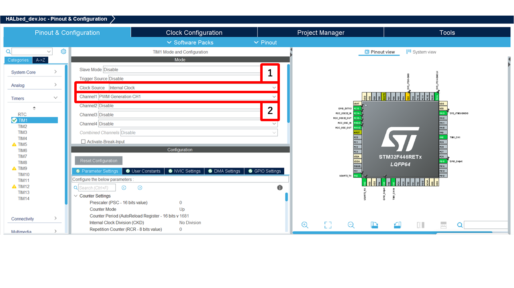
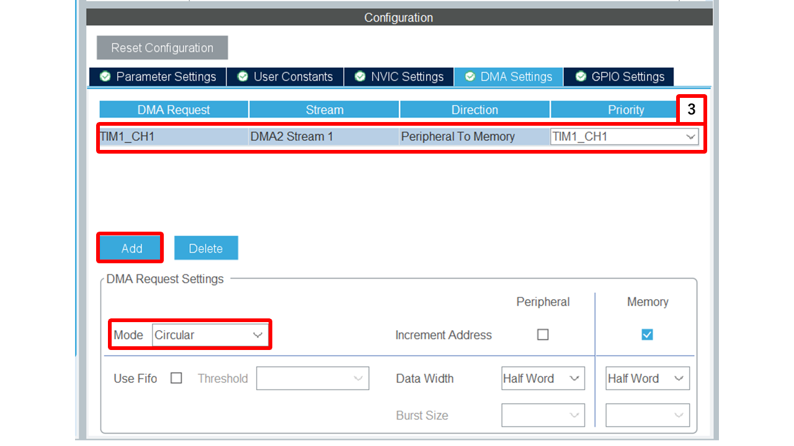

# PWMOut

## 概要
PWM信号の生成と制御を行うC++クラス群を提供します。タイマーとDMAの制御に対応し、精密なPWMパルス幅・周波数の設定が可能です。

---

## クラス概要
### `PWM`
PWMクラスは、PWM信号の生成および各種制御処理を実現します。

> [!Note]
> STM32のPWMは、以下のようなタイマーの仕組みを利用して生成されます：
> 1. **カウンタ（CNT）** : 0から`ARR`（Auto-Reload Register）までカウントアップする。
> 2. **ARR（オートリロードレジスタ）** : PWMの周期（信号の繰り返し間隔）を決定する。
> 3. **CCR（キャプチャ・コンペアレジスタ）** : PWMのON時間を決定する（デューティ比を設定）。

#### コンストラクタ
```cpp
PWM(TIM_HandleTypeDef* htim, uint32_t channel, uint32_t TIMHz, bool useDMA = false, uint32_t ArrMax = 65536);
```
- htim: TIMハンドル
- channel: PWMチャネル
- TIMHz: タイマーのクロック周波数
- useDMA: DMA制御を使用するか (初期値:false)
- ArrMax: タイマーARRの最大値
ARRの最大値は16bitの場合は65536、32bitの場合は4294967296

#### 主なメソッド

##### `void start()`
PWM出力を開始

---

##### `void stop()`
PWM出力を停止

---

##### `void setFrequency(uint32_t destFreq)`
指定した周波数にタイマー設定を調整
> - `destFreq` : 目標周波数

---

##### `void pulsewidth_us(uint32_t pulseWidth)`
PWMパルス幅をマイクロ秒単位で指定
> - `pulseWidth` : パルス幅（マイクロ秒）

---

##### `void pulsewidth_ms(uint32_t pulseWidth)`
PWMパルス幅をミリ秒単位で指定
> - `pulseWidth` : パルス幅（ミリ秒）

---

##### `float getDutyCycle() const`
現在のデューティサイクルを返す
> - デューティサイクル（0.0〜1.0）

---

##### `void setDutyCycle(float duty)`
指定したデューティサイクルに設定
> - `duty` : デューティサイクル（0.0〜1.0）

---

##### `float getFrequency() const`
実際に設定されている周波数を返す
> - 周波数（Hz）

---

## 使用方法
### CubeMXの設定
1. Clock Source を`Internal Clock`に設定。
2.  TIM1を展開し,Channel~ の設定を `PWM Generation CH~` に設定。
(同時にピンが設定されます)

3. DMAを使用するチャンネルで設定する (使用しない場合はスキップ)



### app_main.cpp内
1. PWMクラスのインスタンスを生成します
   ```cpp
   PWM pwm(&htim1, TIM_CHANNEL_1, 84e6, true);
   ```

2. 必要な制御を実施します
   ```cpp
   pwm.start();
   pwm.setFrequency(50000);
   pwm.pulsewidth_us(10);
   ```

3. 使用終了時、PWM出力を停止します
   ```cpp
   pwm.stop();
   ```

---

## 注意事項
- DMA使用時は、DMAの初期化など適切な設定が必要
- タイマー設定はシステム全体のクロックに依存するため、正確な値を確認すること

---

## サンプルコード

### Sample 1: 基本的なPWM制御の例
```cpp
#include "main.h"
#include "../../Library/HALbed/Inc/HALbed.hpp"

using namespace HALbed;

extern TIM_HandleTypeDef htim1;

uint16_t HZ = 50000; // 目標周波数
float duty = 0.0f;

extern "C" void app_main() {
    PWM pwm1(&htim1, TIM_CHANNEL_1, 84000000, true);
    PWM pwm2(&htim1, TIM_CHANNEL_2, 84000000, true);

    pwm1.start();
    pwm2.start();

    while (1) {
        duty = 0.5f;
        pwm1.setFrequency(HZ);
        pwm2.setFrequency(HZ);
        pwm1.pulsewidth_us(5);
        pwm2.pulsewidth_us(15);
        // 無限ループ
    }
    // pwm1.stop(); pwm2.stop();
}
```

---

### Sample 2: PWM出力のパルス幅交互変更例 
```cpp
#include "main.h"
#include "../../Library/HALbed/Inc/HALbed.hpp"

using namespace HALbed;

extern TIM_HandleTypeDef htim1;

int main() {
    PWM pwm1(&htim1, TIM_CHANNEL_1, 84000000, true);
    pwm1.start();
    
    // PWM周波数50000Hz、パルス幅を交互に10usと20usに変更
    while (1) {
        pwm1.setFrequency(50000);
        pwm1.pulsewidth_us(10);
        HAL_Delay(100);
        pwm1.pulsewidth_us(20);
        HAL_Delay(100);
    }

    pwm1.stop();
    return 0;
}
```

---

### Sample 3: 複数チャネルでデューティサイクルを入れ替える例
```cpp
#include "main.h"
#include "../../Library/HALbed/Inc/HALbed.hpp"

using namespace HALbed;

extern TIM_HandleTypeDef htim1;

int main() {
    PWM pwm1(&htim1, TIM_CHANNEL_1, 84000000, true);
    PWM pwm2(&htim1, TIM_CHANNEL_2, 84000000, true);

    pwm1.start();
    pwm2.start();

    while (1) {
        pwm1.setDutyCycle(0.25f);
        pwm2.setDutyCycle(0.75f);
        HAL_Delay(500);
        pwm1.setDutyCycle(0.75f);
        pwm2.setDutyCycle(0.25f);
        HAL_Delay(500);
    }

    pwm1.stop();
    pwm2.stop();
    return 0;
}
```

---

### Sample 4: DMAを使用しないPWM制御例
```cpp
#include "main.h"
#include "../../Library/HALbed/Inc/HALbed.hpp"

using namespace HALbed;

extern TIM_HandleTypeDef htim1;

int main() {
    // DMA無使用 (useDMA = false) のPWM制御例
    PWM pwm(&htim1, TIM_CHANNEL_1, 84000000, false);
    pwm.start();
    
    while (1) {
        pwm.setFrequency(50000);
        pwm.pulsewidth_us(10);
        HAL_Delay(100);
        pwm.pulsewidth_us(20);
        HAL_Delay(100);
    }
    
    pwm.stop();
    return 0;
}
```

### sample 5 : RGB LEDテープを光らせる
```cpp
#include "main.h"
#include "../../Library/HALbed/Inc/UART.hpp"
#include "../../Library/HALbed/Inc/PWMOut.hpp"
#include <math.h>  // For sin() function

using namespace HALbed;

extern UART_HandleTypeDef huart2;
UART pc(&huart2);

extern TIM_HandleTypeDef htim3;
float LED_duty[3] = {0.5f, 0.5f, 0.5f};

PWMOut R(&htim3,TIM_CHANNEL_1,72000000,false);
PWMOut G(&htim3,TIM_CHANNEL_2,72000000,false);
PWMOut B(&htim3,TIM_CHANNEL_3,72000000,false);
PWMOut LED[3] = {R, G, B};

extern "C" void app_main(void) {
    pc.xprintf("main start!\r\n");

    for(int i = 0; i < 3; i++) {
        LED[i].start(); // PWM出力を開始
        LED[i].setFrequency(1000);
        LED[i].setDutyCycle(LED_duty[i]); // 初期デューティサイクルを設定
    }

    float angle = 0.0f;
    const float step = 0.05f;         // より滑らかな遷移のための小さなステップ
    const float PI = 3.14159265359f;  // π定数
    const float phaseShift = PI / 3;  // 60度（ラジアン）
    
    while (1) {
        // LEDの色を変化させるための正弦波を生成
        LED_duty[0] = (sin(angle) + 1.0f) / 2.0f;                  // R: 0°位相
        LED_duty[1] = (sin(angle + phaseShift) + 1.0f) / 2.0f;     // G: 60°位相
        LED_duty[2] = (sin(angle + 2 * phaseShift) + 1.0f) / 2.0f; // B: 120°位相
        
        // すべてのLEDを更新
        for (int i = 0; i < 3; i++) {
            LED[i].setDutyCycle(LED_duty[i]);
            pc.xprintf("LED %d duty: %f\r\n", i, LED_duty[i]);
        }
        
        angle += step;
        if (angle >= 2 * PI) {
            angle -= 2 * PI;
        }
        HAL_Delay(10);
    }
}
```