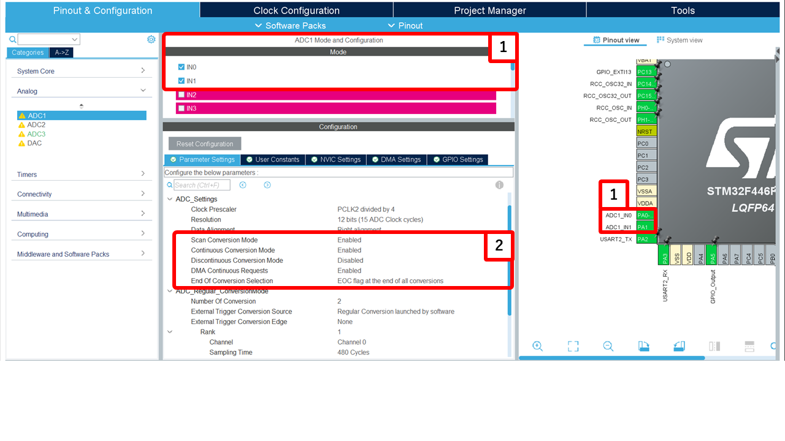
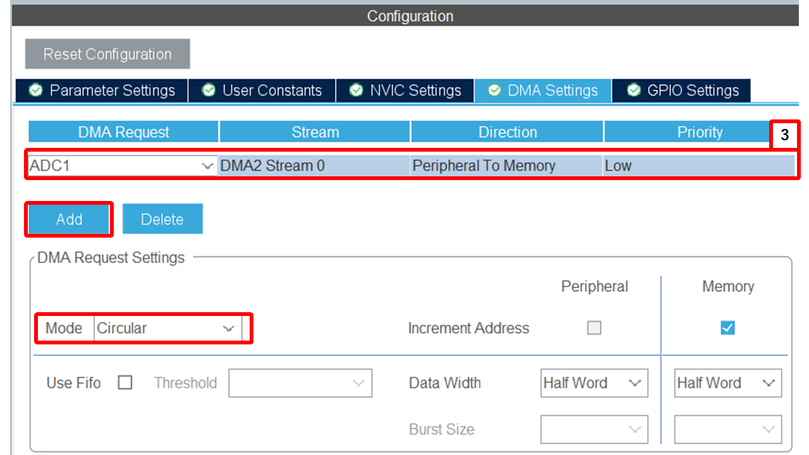

# AnalogIn (ADC)ライブラリ README

## 概要
AnalogIn クラスは、ADCを用いてアナログ入力を取得し、電圧値に変換します。HALライブラリのADC機能を利用し、DMAを使いCPUに負荷をかけないデータ取得も可能です。

## クラス概要
### `AnalogIn`
AnalogIn クラスは、ADCハンドルとチャネル数を受け取り、各チャネルのADC変換値を管理します。ADCの分解能に基づき、電圧に変換する read_voltage メソッドを備えています。

#### コンストラクタ
```cpp
AnalogIn(ADC_HandleTypeDef* hadc, uint8_t channelCount, float maxInputVoltage = 3.3f);
```
- hadc: ADCハンドル
- channelCount: 使用するADCチャネル数
- maxInputVoltage: 入力電圧の最大値（デフォルトは3.3V）

#### メソッド

##### `bool init()`
DMAを用いてADC変換を開始
> - `true` : 初期化成功
> - `false` : 初期化失敗

---

##### `uint16_t read(uint8_t channel)`
指定チャネルのADC変換値を返す
> - `channel` : チャネル番号
> - ADC変換値（無効なチャネルの場合は 0）

---

##### `float read_voltage(uint8_t channel)`
指定チャネルの電圧値を計算して返す。計算式は以下の通り:

```
電圧値 = (ADC変換値 * maxInputVoltage) / ADC_Resolution
```
> - `channel` : チャネル番号
> - 電圧値

## 使用方法
### CubeMXの設定例
1. 変換のチャンネル・ピンを指定し、各設定を行う

#### 設定内容

- **Clock Prescaler**: `PCLK2 divided by 4`
  > [!CAUTION]
  > 各シリーズで設定が異なる場合があります。詳細は各シリーズのデータシート等を参照してください。

  - ADCのクロックはPCLK2を4分割したものを使用。
  - 適切なサンプリング時間を確保するために設定。
  -  ADC クロックモード比較：同期 vs 非同期
  
  <!-- ハードの説明に移動するかも -->
  > [!NOTE]
  > G4シリーズのシリーズでは設定が異なり、クロック源を選択できます。
  >　以下の表は、G4シリーズのADCクロックモードの比較です。詳細は各シリーズのデータシート等を参照してください。
  > | 項目                  | 同期（Synchronous）モード                                                  | 非同期（Asynchronous）モード                                                  |
  > |-----------------------|---------------------------------------------------------------------------|------------------------------------------------------------------------------|
  > | クロック源             | バス／APB 系から分周されたクロック                                          | 専用クロック源（例：PLL 出力）からの非同期クロック                             |
  > | 他ペリフェラルとの同期性 | 高い（タイマーなどとの同期がとりやすい）                                  | 低め／独立動作する設計に適している                                            |
  > | ノイズ・バス負荷の影響 | 受けやすい                                                                 | 影響を受けにくい                                                               |
  > | 設定自由度             | やや制約あり                                                               | 高め                                                                           |
  > | 活用シーン             | タイマートリガーの変換、複数 ADC の同期取得                                 | 高精度測定、バス変動やノイズが懸念される環境                                  |
  > | 注意点               | ADC クロックが仕様上の上限を超えると精度低下や不安定動作の原因となる       | クロック源の選定・分周比設計を誤ると性能低下・誤データ取得のリスクあり             |


- **Resolution**: `12 bits (15 ADC Clock cycles)`
  - 変換解像度は12ビット（0～4095の範囲でデータ取得）。
  - 1回の変換に15クロックサイクルを要する。

- **Data Alignment**: `Right alignment`
  - 変換結果のデータを右詰めで格納。
  - 12ビットデータの上位4ビットがゼロ埋めされる。

- **Scan Conversion Mode**: `Enabled`
  - 複数のADCチャンネルを連続的に変換する。

- **Continuous Conversion Mode**: `Enabled`
  - 変換が終了すると次の変換を自動開始。
  - 常時データを取得する用途に適している。

- **Discontinuous Conversion Mode**: `Disabled`
  - 無効になっているため、スキャン変換時にすべてのチャンネルを連続変換。

- **DMA Continuous Requests**: `Enabled` (DMAを使う場合)
  - DMAを使用してCPUを介さずにデータをメモリへ直接転送。
  - CPU負荷を低減しながら効率的なデータ取得が可能。

- **End Of Conversion Selection**: `EOC flag at the end of all conversions`
  - すべてのチャンネルの変換が完了した際にEOC（End Of Conversion）フラグがセットされる。
  - 変換が完了してからデータを取得可能。

1. DMAを使用するチャンネルで設定する (使用しない場合はスキップ)

Modeは `Circular` に設定する
 
### cppmain.cpp内
1. ADCハンドルとチャネル数を指定して、AnalogIn インスタンスを生成します
   ```cpp
   HALbed::AnalogIn analogInput(&hadc1, numberOfChannels, 3.3f);
   ```

2. init() メソッドでDMAによるADC変換を開始します (DMAを使用する場合)
   ```cpp
   if (analogInput.init()) {
       // 初期化成功
   } else {
       // 初期化失敗
   }
   ```

3. read() または read_voltage() で各チャネルの値を取得する。
- ポーリング使用時:
   ```cpp
   uint16_t adcValue = analogInput.poll_read(0, timeout);
   float voltage = analogInput.poll_read_voltage(0, timeout);
   ```
- DMA使用時:
   ```cpp
   uint16_t adcValue = analogInput.read(0);
   float voltage = analogInput.read_voltage(0);
   ```

## 依存関係
-STM32 HALライブラリ

## 注意事項
- HAL_ADCの初期化とDMA設定が正しく行われている必要があります
- DMAでチャネル数が誤っていると、不正なメモリアクセスや動作不良の原因となる可能性があります

---


## サンプルコード
ADC 2chのサンプルコード
```cpp
#include "main.h"
#include "../Library/HALbed/Inc/HALbed.hpp"

extern UART_HandleTypeDef huart2;
extern ADC_HandleTypeDef hadc3;
using namespace HALbed;
AnalogIn analogIn(&hadc3, 1);
UART pc(&huart2);

__IO uint32_t ad;
double v;

extern "C" void cppmain(void)
{
    // DMAで連続取得する場合
    // analogIn.init();
    // pc.xprintf("DMA setup done\r\n");

    // ポーリングで読み取る場合の例（DMAを使わない）
    pc.xprintf("Polling ADC example\r\n");
    while (true) {
        // ポーリングAPIを使って簡単に読み出す
        ad = analogIn.poll_read(0, 1000);
        v = analogIn.poll_read_voltage(0, 1000);
        
        // DMAを使う場合
        // ad = analogIn.read(0);
        // v = analogIn.read_voltage(0);
        
        pc.xprintf("ADC Value: %lu\tVoltage: %.2fV\r\n", ad, v);
        HAL_Delay(50);
    }
} 
```
---

## STM32 CubeMX ADC入力設定の種類まとめ

> [!CAUTION]
> 以下の内容は、**"HAL" ライブラリを使用する場合のADC入力設定に関するものです。** <br>
> HALbedでは、**ADCの差動入力はサポートされていません。** 単端入力のみをサポートしています。

一部シリーズでCubeMXでADCチャンネルを設定する際、各入力ピンに対して以下の3つの設定を選択できます：

- **Disable**
- **Single-ended**
- **Differential**

---

###  Disable
- チャンネルを **無効化** します。
- この設定では、コード生成時に該当チャンネルの初期化は行われません。

| 項目 | 内容 |
|------|------|
| 入力タイプ | 無効 |
| 入力ピン数 | 0 |
| 測定対象 | なし |
| 主な用途 | 使用しないチャンネルを無効化 |

---

### Single-ended（単端入力）
単端入力では、**1本のADC入力ピン** の電圧を **GND（またはVSSA）** と比較して測定します。  
一般的なセンサーや電圧測定に使われる最も標準的なモードです。

| 項目 | 内容 |
|------|------|
| 入力ピン | 1本（例: `ADC_IN4`） |
| 比較相手 | GND（VSSA） |
| 出力範囲 | 0 ～ Vref（例: 0〜3.3V） |
| メリット | 配線が簡単・外部回路不要 |
| デメリット | GNDノイズやコモンモードノイズの影響を受けやすい |
| 主な用途 | センサー出力、可変抵抗、電圧モニタなど |

> [!NOTE]
> 使用例
> センサーのアナログ出力をADC_IN4に接続し、GNDを共通にして測定する。

#### Differential（差動入力）
差動入力では、2本の入力ピン（例: IN4+ と IN4−） の電圧差を測定します。
ノイズ耐性が高く、より高精度な計測に向いています。

| 項目 | 内容 |
|------|------|
| 入力ピン | 2本（例: IN4+, IN4−） |
| 比較相手 | もう一方の入力ピン（IN4−） |
| 出力範囲 | ±Vref（差電圧） |
| メリット | ノイズ耐性が高い（共通ノイズを除去できる） |
| デメリット | 入力ピンが2倍必要・外部回路がやや複雑 |
| 主な用途 | 電流検出（シャント抵抗）、ブリッジセンサー、差動出力センサーなど |

> [!NOTE] 使用例
> シャント抵抗の両端をIN4+ / IN4−に接続し、電流による電圧差を測定する。

> [!TIP]
> 詳細はSTM のコニュニティーフォーラムやデータシートを参照してください。
> 
> [デュアル レギュラー + 差動モードで ADC を読み取るにはどうすればよいでしょうか? - STM32 Community](https://community.st.com/t5/stm32cubemx-mcus/how-to-read-adc-with-dual-regular-differential-mode/td-p/317205)

### まとめ
| 設定名 | 入力タイプ | 入力ピン数 | 測定対象 | 主な用途 |
|--------|------------|------------|----------|----------|
| Disable | 無効 | 0 | なし | チャンネル未使用 |
| Single-ended | 単端入力 | 1 | INx vs GND | 一般的な電圧計測 |
| Differential | 差動入力 | 2 | INx+ vs INx− | 高精度・ノイズ除去が必要な計測 |
