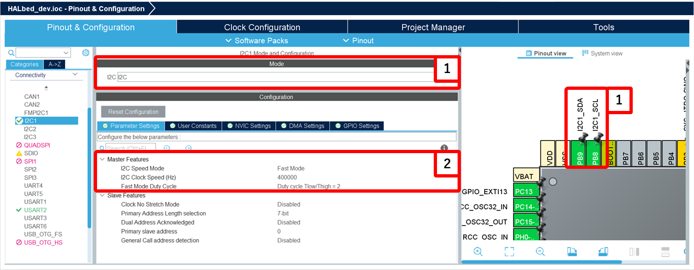
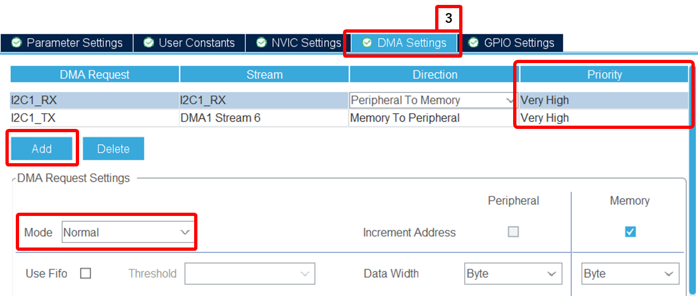
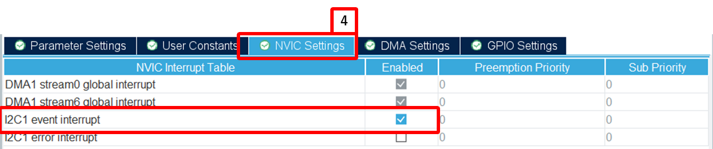

# I2C

## 概要
このライブラリは、I2C通信を簡単に行うためのクラスを提供します。

---

## クラス概要
### `I2C`
I2Cクラスは、I2C通信を行うための機能を提供します。

#### コンストラクタ
```cpp
I2C(I2C_HandleTypeDef *hi2c);
```
- `hi2c` : I2Cハンドル

#### メソッド

##### `int write(uint8_t address, const uint8_t *data, uint16_t length)`
I2Cスレーブへデータを書き込む
> - `address` : スレーブデバイスの7ビットアドレス
> - `data` : 送信データ
> - `length` : 送信データの長さ

---

##### `int read(uint8_t address, uint8_t *data, uint16_t length)`
I2Cスレーブからデータを読み込む
> - `address` : スレーブデバイスの7ビットアドレス
> - `data` : 受信データ格納用バッファ
> - `length` : 受信データの長さ

---

##### `int writeMem(uint8_t address, uint16_t memAddress, uint8_t *data, uint16_t length)`
メモリ（レジスタ）書き込み
> - `address` : スレーブデバイスの7ビットアドレス
> - `memAddress` : メモリアドレス
> - `data` : 送信データ
> - `length` : 送信データの長さ

---

##### `int readMem(uint8_t address, uint16_t memAddress, uint8_t *data, uint16_t length)`
メモリ（レジスタ）読み込み
> - `address` : スレーブデバイスの7ビットアドレス
> - `memAddress` : メモリアドレス
> - `data` : 受信データ格納用バッファ
> - `length` : 受信データの長さ

---

##### `int isDeviceReady(uint8_t address, uint32_t trials = 10, uint32_t timeout = 100)`
I2Cデバイスの準備状態を確認
> - `address` : スレーブデバイスの7ビットアドレス
> - `trials` : 試行回数
> - `timeout` : タイムアウト時間（ミリ秒）

---

##### `int writeDMA(uint8_t address, const uint8_t *data, uint16_t length)`
**DMA**を使用してI2Cスレーブへデータを書き込む
> - `address` : スレーブデバイスの7ビットアドレス
> - `data` : 送信データ
> - `length` : 送信データの長さ

---

##### `int writeMemDMA(uint8_t address, uint16_t memAddress, uint16_t memAddSize, uint8_t *data, uint16_t length)`
**DMA**を使用してI2Cスレーブの特定のメモリアドレスに対してデータを書き込む
> - `address` : スレーブデバイスの7ビットアドレス
> - `memAddress` : メモリアドレス
> - `memAddSize` : メモリアドレスのサイズ
> - `data` : 送信データ
> - `length` : 送信データの長さ

---

##### `int readDMA(uint8_t address, uint8_t *data, uint16_t length)`
**DMA**を使用してI2Cスレーブからデータを読み込む
> - `address` : スレーブデバイスの7ビットアドレス
> - `data` : 受信データ格納用バッファ
> - `length` : 受信データの長さ

---

##### `int readMemDMA(uint8_t address, uint16_t memAddress, uint16_t memAddSize, uint8_t *data, uint16_t length)`
**DMA**を使用してI2Cスレーブの特定のメモリアドレスからデータを読み込む
> - `address` : スレーブデバイスの7ビットアドレス
> - `memAddress` : メモリアドレス
> - `memAddSize` : メモリアドレスのサイズ
> - `data` : 受信データ格納用バッファ
> - `length` : 受信データの長さ


---

## 使用方法
### CubeMX の設定
1. 使用するモードとIOピンの設定
2. I2C のモードとクロック周波数の設定

    - `Mode` を `I2C` に設定し、ピンを設定する
    - `I2C Speed Mode` を設定し、 `I2C Clock Speed (Hz)` を設定する
    

3. DMAの有効化 (以降、DMA方式で使用するときのみ)

    - `DMA Settings`に移動し、`Add` から `RX` / `TX`のDMAを有効化する
    - それぞれ `Mode` をノーマルに設定する
    - Priority を適説に設定する
      - 他のDMAなどと優先順位を付け設定する
    

4. 割り込みの設定
    
    - `NVIC Settings` に移動し `I2C event interrrupt` を有効化する
    

> [!caution]
> **I2CのDMAでは `circular Mode`の動作は補償されていません。** <br>
> **必ず`Normal Mode`で設定してください。**<br><br>
> `circular Mode`で実装したい場合は、ユーザー側で実装を行ってください。
> 詳細は以下のリンクを参照してください。
> [I2C In Master Receive Mode, DMA transfer in circular mode not working - ST community](https://community.st.com/t5/stm32-mcus-products/i2c-in-master-receive-mode-dma-transfer-in-circular-mode-not/td-p/733589) <br>
> [STM32F103 I2C Receive using DMA in Circular mode - ST community](https://community.st.com/t5/stm32-mcus-products/stm32f103-i2c-receive-using-dma-in-circular-mode/td-p/481384) <br>
> また各アプリケーションノートも参考にしてください。


### app_main.cpp
1. `I2C`クラスのインスタンスを作成
   ```cpp
   I2C i2c(&hi2c1);
   ```
   
2. 必要に応じてデータの書き込みや読み込む
   ```cpp
   uint8_t data[] = {0x01, 0x02};
   i2c.write(0x50, data, sizeof(data));
   ```

3. メモリの書き込む (読み込む)
   ```cpp
   uint8_t memData[] = {0x01, 0x02};
   i2c.writeMem(0x50, 0x10, memData, sizeof(memData));
   ```

4. DMAを使用してデータの書き込む (読み込む)
   ```cpp
   uint8_t data[] = {0x01, 0x02};
   i2c.writeDMA(0x50, data, sizeof(data));
   ```

5. DMAを使用してメモリの書き込む (読み込む)
   ```cpp
   uint8_t memData[] = {0x01, 0x02};
   i2c.writeMemDMA(0x50, 0x10, I2C_MEMADD_SIZE_8BIT, memData, sizeof(memData));
   ```

---

## 注意事項
> [!caution]
> ポーリング方式で高速・大量のデータをやり取りをする場合、CPUの負荷が大きくなってしまいます。
> 高速・大量の送受信を行う場合、DMA方式で実装してください。
> DMAを有効にして、 ...DMA(); を呼び出してください。
> (HALの仕様で有効化されなくてもビルド通ってしまいます)

---
## サンプルコード

### 基本的な送受信
```cpp
#include "main.h"
#include <string.h>
#include "../../../Library/HALbed/Inc/UART.hpp" // ターミナルに出力するのにUARTクラスを使用するため
#include "../../../Library/HALbed/Inc/i2c.hpp"
using namespace HALbed;

extern UART_HandleTypeDef huart2; // 外部宣言
extern I2C_HandleTypeDef hi2c1;

UART pc(&huart2);
I2C  i2c(&hi2c1);

extern "C" void app_main(void) {
    pc.enableRxInt();
 	pc.xprintf("\033[1;1HScanning I2C bus:\r\n");
    while (1) {
        uint8_t data[2];
        int result;
        addr = 0x123;
        result = i2c.isDeviceReady(addr, 1, 10);
        if (result == HAL_OK) {
            uint8_t txData = 0x00; // Data to send
            uint8_t rxData;
            i2c.write(addr, &txData, 1);
            i2c.read (addr, &rxData, 1);
            pc.xprintf("0x%02X, 0x%x ", addr,rxData);
        } else {
            pc.xprintf("failure send\n\r");
        }
        pc.xprintf("\r\n");

        HAL_Delay(1000); // Wait for 1 second before scanning again
    }
}
```

### メモリ(レジスタ) の値を読み書き
```cpp
#include "main.h"
#include "../../Library/HALbed/Inc/HALbed.hpp"
using namespace HALbed;

extern UART_HandleTypeDef huart2; // 外部宣言
extern I2C_HandleTypeDef hi2c1;

UART pc(&huart2);
I2C i2c(&hi2c1);

extern "C" void app_main() {
    uint8_t deviceAddress = 0x50; // I2Cデバイスのアドレス（例）
    uint16_t memAddress = 0x10;   // レジスタアドレス（例）
    uint8_t writeData[2] = {0x12, 0x34}; // 書き込むデータ
    uint8_t readData[2] = {0};           // 読み取り用バッファ

    // デバイスの準備確認
    if (i2c.isDeviceReady(deviceAddress) == 0) {
        // メモリ書き込み
        if (i2c.writeMem(deviceAddress, memAddress, writeData, sizeof(writeData)) == 0) {
            pc.xprintf("Write success\n");
        } else {
            pc.xprintf("Write failed\n");
        }

        HAL_Delay(10); // 書き込みの反映を待機（デバイスによる）

        // メモリ読み込み
        if (i2c.readMem(deviceAddress, memAddress, readData, sizeof(readData)) == 0) {
            pc.xprintf("Read success: 0x%02X 0x%02X\n", readData[0], readData[1]);
        } else {
            pc.xprintf("Read failed\n");
        }
    } else {
        pc.xprintf("Device not ready\n");
    }

    while (1) {
        HAL_Delay(1000);
    }
}
```

### i2c bus scaner
接続されたデバイスのIDがグリット状に表示します
実行例 (BNO055)
```
Scanning I2C bus:
     0  1  2  3  4  5  6  7  8  9  a  b  c  d  e  f
00: -- -- -- -- -- -- -- -- -- -- -- -- -- -- -- --
10: -- -- -- -- -- -- -- -- -- -- -- -- -- -- -- --
20: -- -- -- -- -- -- -- -- 28 -- -- -- -- -- -- --
30: -- -- -- -- -- -- -- -- -- -- -- -- -- -- -- --
40: -- -- -- -- -- -- -- -- -- -- -- -- -- -- -- --
50: -- -- -- -- -- -- -- -- -- -- -- -- -- -- -- --
60: -- -- -- -- -- -- -- -- -- -- -- -- -- -- -- --
70: -- -- -- -- -- -- -- -- -- -- -- -- -- -- -- --
```
```cpp
#include "main.h"
#include "../../Library/HALbed/Inc/HALbed.hpp"
using namespace HALbed;

extern UART_HandleTypeDef huart2; // 外部宣言
extern I2C_HandleTypeDef hi2c1;

UART pc(&huart2);
I2C i2c(&hi2c1);

extern "C" void app_main(void) {
    pc.enableRxInt();
 	pc.xprintf("\033[1;1HScanning I2C bus:\r\n");
    uint8_t address;
     pc.xprintf("     0  1  2  3  4  5  6  7  8  9  a  b  c  d  e  f\r\n");
     for (int i = 0; i < 128; i += 16) {
         pc.xprintf("%02x: ", i);
         for (int j = 0; j < 16; j++) {
             address = i + j;
             int ret = i2c.isDeviceReady(address,2,2);
             if (ret == HAL_OK) {
                 pc.xprintf("%02x ", address);
             } else if (ret == HAL_TIMEOUT) {
                 pc.xprintf("UU ");
             } else {
                 pc.xprintf("-- ");
             }
         }
         pc.xprintf("\r\n");
     }
    while (1) {
    }
}
```

### DMAを使用した基本的な送受信
```cpp
#include "main.h"
#include "../../Library/HALbed/Inc/HALbed.hpp"
using namespace HALbed;

extern UART_HandleTypeDef huart2; // 外部宣言
extern I2C_HandleTypeDef hi2c1;

UART pc(&huart2);
I2C i2c(&hi2c1);

extern "C" void app_main(void) {
    pc.enableRxInt();
    pc.xprintf("DMA I2C Communication Example\r\n");

    uint8_t txData[] = {0x01, 0x02};
    uint8_t rxData[2];

    // データ送信
    if (i2c.writeDMA(0x50, txData, sizeof(txData)) == 0) {
        pc.xprintf("Data sent successfully\r\n");
    } else {
        pc.xprintf("Data send failed\r\n");
    }

    HAL_Delay(100); // DMAの完了を待つ

    // データ受信
    if (i2c.readDMA(0x50, rxData, sizeof(rxData)) == 0) {
        pc.xprintf("Data received: 0x%02X 0x%02X\r\n", rxData[0], rxData[1]);
    } else {
        pc.xprintf("Data receive failed\r\n");
    }

    while (1) {
        HAL_Delay(1000);
    }
}
```

### DMAを使用したBNO055から情報を取得するコード (おまけ)
> [!Tip]
> BNO055の簡易的なテストコードです。
> このコードでも値を取得できますが、**BNO055 のライブラリを使うことを強く推奨します。**

```cpp
#include "main.h"
#include "../../Library/HALbed/Inc/HALbed.hpp"
using namespace HALbed;

extern UART_HandleTypeDef huart2; // 外部宣言
extern I2C_HandleTypeDef hi2c1;

UART pc(&huart2);
I2C i2c(&hi2c1);

#define BNO055_I2C_ADDR  0x28       // 7bitアドレスを左シフト
#define BNO055_RESET_REG 0x3F       // リセットレジスタ
#define BNO055_MODE_REG  0x3D       // モードレジスタ
#define BNO055_EULER_H_LSB 0x1A     // yawのレジスタ

uint8_t txBuffer[2];
uint8_t rxBuffer[6];  //(Yaw, Roll, Pitch)
float Yaw_deg, roll_deg, pitch_deg;
void BNO055_Reset();
void BNO055_SetMode();
void BNO055_ReadEulerRaw();
void BNO055_convrtEulerData();

extern "C" void app_main(void) {
    pc.xprintf("BNO055 Init...\r\n");
    BNO055_Reset();
    BNO055_SetMode();
    while (1) {
        BNO055_ReadEulerRaw();
        BNO055_convrtEulerData();
        pc.xprintf("Yaw: %f, Roll: %f, Pitch: %f  |\r\n", Yaw_deg, roll_deg, pitch_deg);
        HAL_Delay(100);
    }
}

void BNO055_Reset() {
    txBuffer[0] = BNO055_RESET_REG;
    txBuffer[1] = 0x20;
    i2c.writeDMA(BNO055_I2C_ADDR, txBuffer, 2);
    HAL_Delay(675);
}

void BNO055_SetMode() {
    txBuffer[0] = BNO055_MODE_REG;
    txBuffer[1] = 0x0C;
    i2c.writeDMA(BNO055_I2C_ADDR, txBuffer, 2);
    HAL_Delay(675);
}

void BNO055_ReadEulerRaw() {
    i2c.readMemDMA(BNO055_I2C_ADDR, BNO055_EULER_H_LSB, I2C_MEMADD_SIZE_8BIT, rxBuffer, 6);
}

void BNO055_convrtEulerData() {
    int16_t Yaw = (rxBuffer[1] << 8) | rxBuffer[0];
    int16_t roll    = (rxBuffer[3] << 8) | rxBuffer[2];
    int16_t pitch   = (rxBuffer[5] << 8) | rxBuffer[4];
    Yaw_deg   = Yaw / 16.0;
    roll_deg  = roll / 16.0;
    pitch_deg = pitch / 16.0;
}
```