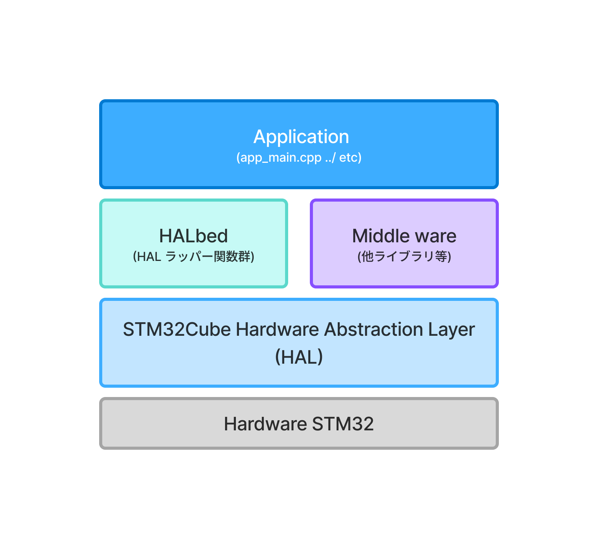

# 概要

HALbedは、HAL（Hardware Abstraction Layer）を抽象化し、より使いやすいインターフェースを提供するためのライブラリです。

> [!caution] 利用にあたっての注意点
> HALbedは、HALを抽象化するためのライブラリであり、HALの全ての機能を完全にカバーするものではありません。 
> 本ライブラリに起因する不具合や問題については、責任を負いかねます。 
> マイコンの動作を保証するものではなく、特定の機能や高度な設定には対応していません。 
> **必要に応じて、HALを直接呼出して利用することを推奨します。** 
> ドキュメントについても、同様に内容の正確性を保証するものではありません。 
> また、すべてのシリーズに対応しているわけではないため、公式の**リファレンスマニュアルやデータシートを参照**してください。
>
> より多くの機能、シリーズに対応するため、IssueやPull Requestを歓迎します。

## HALラッパーの位置づけ

HALラッパーは、HALが提供する各機能（GPIO、タイマー、I2C、SPI、UART等）を分かりやすくまとめて公開します。  

## HALbed / HALラッパーできること

- HALの抽象化・簡略化  
  複雑なHAL APIをシンプルなインターフェースで提供し、開発者が簡単にに利用できるようにします。
- 初期化の簡素化  
  各種デバイスの初期化手順を簡略化し、コード量を削減します。
- mbed OS6 に近いAPIの提供  
  mbed OS6 の設計思想を取り入れたAPIを提供し、既存のmbedユーザーがスムーズに移行できるようにします。

## HALbed / HALラッパーで想定していないこと
- 高度な機能の提供  
  HALの全ての高度な機能や特殊な設定には対応していません。必要に応じてHALを直接利用することを推奨します。
  - PWMの同期制御
  - DMAを利用した高速データ転送
   (一部対応していますが、DMAを使う場合はHALを直接利用することを推奨します)
  - 特定のマイコンやシリーズに依存する機能の提供 ...etc
- 完全な互換性の保証  
  mbed OS6 の全てのAPIと完全な互換性を保証するものではありません。基本的な使用方法に焦点を当てています。
- 特定のハードウェア依存機能  
  特定のマイコンやボードに依存する機能には対応していません。汎用的な機能に焦点を当てています。

> [!Note]
> 抽象化レイヤーであるため、パフォーマンスが若干低下する可能性があります。**リアルタイム性が厳しく要求されるアプリケーションでは、直接HAL/LLを利用**することを推奨します。

