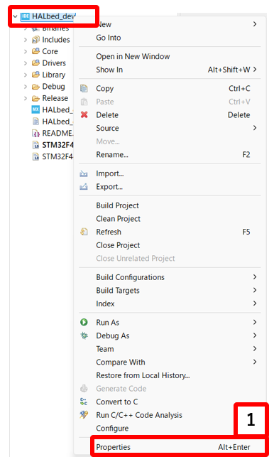
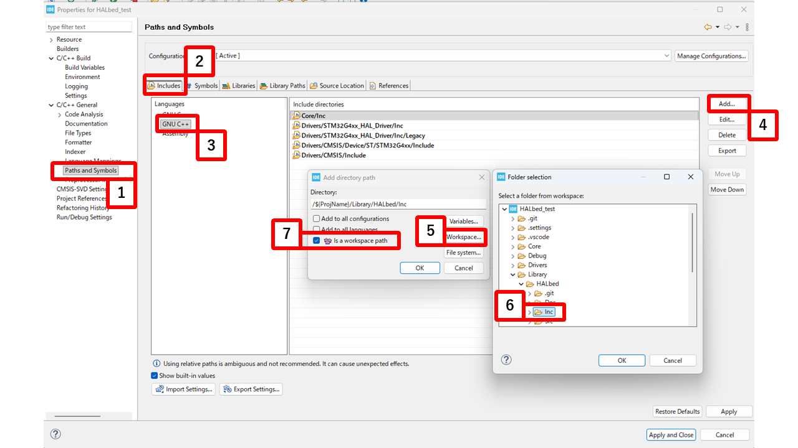
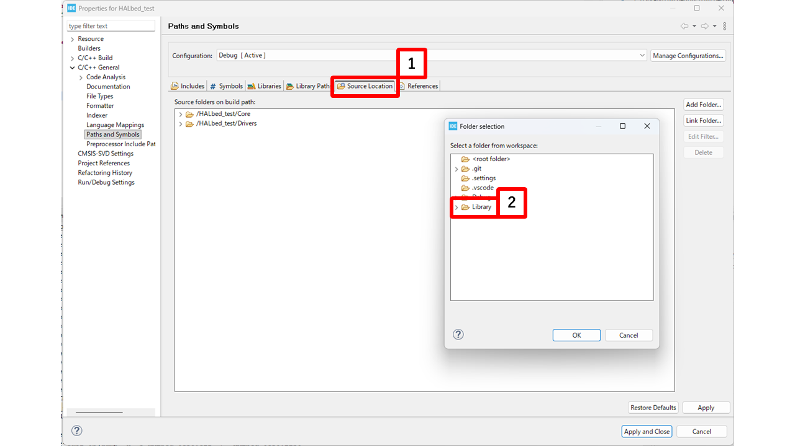

# インストールと初期設定

このページでは、既存の STM32CubeIDE プロジェクトに HALbed ライブラリを導入する手順を説明します。

## 必要な環境

- **STM32CubeIDE**（1.19 以前推奨）

他に Visual Studio Code の拡張機能を用いている環境でも同様に使えますが、ここではIDEの中心に説明します。

## 1. HALbed の入手
必要に応じて、`Library`ディレクトリを作成してください。

```bash
mkdir Library
cd Library
```

GitHub リポジトリからクローンまたはダウンロードします。
```bash
git clone https://github.com/NITIC-Robot-Club/HALbed.git
```

または、[GitHub のリリースページ](https://github.com/NITIC-Robot-Club/HALbed/releases) から ZIP をダウンロードして展開してください。

## 2. プロジェクトへの配置

ダウンロードした HALbed フォルダを、プロジェクト内の `Library/` ディレクトリに配置します。

```
app_project/
├─ Core/
│  ├─ Inc/
│  │  └─ main.h
│  └─ Src/
│     ├─ main.c
│     └─ app_main.cpp     ← 後で作成
└─ Library/
   └─ HALbed/             ← ここに配置
      ├─ Inc/
      │  ├─ HALbed.h
      │  ├─ HALbedConfig.h
      │  └─ ...
      └─ Src/
         └─ ...
```

> [!TIP]
> ディレクトリ構成の詳細は次のページの [ディレクトリ構造](./DirectoryStructure.md) を参照してください。

## 3. CubeIDE のビルド設定

### インクルードパスの追加

ヘッダファイル（`.h`）を認識させるため、インクルードパスを登録します。

1. プロジェクトを右クリック → **Properties** を開く

2. **C/C++ General** → **Paths and Symbols** → **Includes** タブを開く

3. **Add...** をクリックし、HALbed のヘッダフォルダを追加する
   ```
   Library/HALbed/Inc
   ```

これで `.hpp` ファイルがビルド時に認識されます。

### ソースフォルダの追加

ソースファイル（`.c` / `.cpp`）もビルド対象に含める必要があります。

1. 同じ **Paths and Symbols** 画面で **Source Location** タブを開く

2. **Add Folder...** をクリックし、Library のソースフォルダを追加する
   ```
   Library/
   ```

これにより、Library以下にあるのソースファイルがビルド対象に含まれます。
(ソースは「フォルダ単位でビルド対象」になるため、親フォルダを追加すれば再帰的にビルドされます。)

## 4. HALbedConfig.h の設定

`Library/HALbed/Inc/HALbedConfig.h` を開き、`main.h` へのパスが正しいことを確認します。

```c
// HALbedConfig.h
#ifndef HALBED_MAIN_HEADER_PATH
    #define HALBED_MAIN_HEADER_PATH "../../Core/Inc/main.h"  // 推奨構成の場合
#endif
```

> [!NOTE]
> `Library/HALbed/` 以外の場所に配置した場合は、`HALBED_MAIN_HEADER_PATH` を適切なパスに変更してください。  
> 例：`Core/Library/HALbed/` に配置した場合は `"../Inc/main.h"` にします。

## 5. app_main.cpp の作成

`Core/Src/` に `app_main.cpp` を作成し、C++ 側のエントリポイントを記述します。

```cpp
// Core/Src/app_main.cpp
#include "main.h"
#include "../../Library/HALbed/Inc/HALbed.hpp"
using namespace HALbed;

extern "C" void app_main(void)
{
    while (true) {
    }
}

```

次に、`Core/Src/main.c` の `/* USER CODE BEGIN 2 */` セクションで `app_main()` を呼び出します。

```c
/* USER CODE BEGIN 2 */
extern void app_main(void);
app_main();
/* USER CODE END 2 */
```
(`void app_main();`をmain.h で宣言しても良いですが、編集箇所を少なくするため、C++ファイル内で宣言しています。)

## 6. ビルドして確認

**Project** → **Build Project**（Ctrl+B）でビルドを実行します。  
エラーなくビルドが完了すれば、HALbed の導入は完了です。

> [!WARNING]
> ビルドエラーが出る場合は、以下を確認してください：
> - インクルードパスが正しく設定されているか
> - `HALbedConfig.h` の `HALBED_MAIN_HEADER_PATH` が `main.h` の実際のパスと一致しているか
> - CubeMX で必要なペリフェラル（GPIO、タイマー等）が有効になっているか

> [!NOTE]
> f303k8などの一部のROMが小さいデバイスでは、HALbedの全機能をビルドするとROMオーバーします。
> その場合は、ファイルを個別でインクルードして、必要な機能だけをビルドする方法を検討してください。