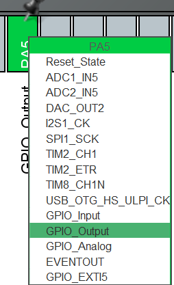

---
tags:
    - 開発資料
    - HAL
thumbnail:
  targets:
    - article-home
    - mcu-home
  description: 'LED 点滅を通して、HAL と HALbed の違いを感じてみましょう'
  order: 20
---

# LチカをHALとHALbedで書いてみる

HALbedは、STM32の**HAL（Hardware Abstraction Layer）ライブラリ**を  
さらに抽象化・リネームしたラッパー関数群です。

ただし、mbedのように「すべてを隠してくれる」わけではなく、  
**中身はそのままHAL** なので、仕組みを理解していないと意図通りに動かないことがあります。

## このページで分かること

- GPIO を使った L チカの流れ
- HAL と HALbed の書き方の違い
- 最初に確認すべき設定

そこでまずは基本中の基本である  
**LEDを点滅させる（Lチカ）** をHALで直接書いてみましょう。

---

## Lチカとは？
Lチカとは

- LEDを点ける（ON）
- 少し待つ
- LEDを消す（OFF）
- また待つ

これを繰り返すだけのプログラムです。

マイコンでは最初の動作確認としてよく使われます。
`Hello, World!`のようなものですね。

---

## 事前に必要な知識

### GPIOとは
GPIO（General Purpose Input Output）は  
**マイコンのピンを入出力として使う機能**です。

今回やること：
- ピンを「出力モード」にする
- 電圧を出す（LED ON）
- 電圧を止める（LED OFF）

---

## 処理の流れ（重要）

Lチカの流れは以下の通りです：

1. HALの初期化
2. クロック設定
3. GPIOの設定（ここが重要）
4. 無限ループでON/OFFを繰り返す

---
## とりあえず動かしてみる
STM32CubeIDEでプロジェクトを作成したら、まずは**GPIOの設定**をしてみましょう。
### GPIOの設定
使うピンをGPIOの出力モードに設定します。
LED を繋いだ適当なピンを選んでください。



設定したあと、保存してコードを生成します。

### プログラム
今回は main.c に直接書いてみます。
main.cの中の一部分を以下のように書き換えてください。HALbedライブラリを使う場合の`app_main()`は呼び出しません

```c
int main(void)
{

// ....
  /* USER CODE BEGIN 2 */
  /* USER CODE END 2 */

  /* Infinite loop */
  /* USER CODE BEGIN WHILE */
  /* Infinite loop */
  /* USER CODE BEGIN WHILE */
  while (1)
  {
    /* USER CODE END WHILE */

    /* USER CODE BEGIN 3 */
    for (int i = 0; i < 20; i++){
        HAL_GPIO_TogglePin(GPIOA, GPIO_PIN_5);  // 点滅
        HAL_Delay(500);
    }
    for (int i = 0; i < 20; i++){
        HAL_GPIO_WritePin(GPIOA, GPIO_PIN_5, GPIO_PIN_SET);  // 点灯
        HAL_Delay(100);
        HAL_GPIO_WritePin(GPIOA, GPIO_PIN_5, GPIO_PIN_RESET);  // 消灯
        HAL_Delay(100);
    }
  }
  /* USER CODE END 3 */
}
```

LEDが繋がっているピンに合わせて、`GPIOA`や `GPIO_PIN_5` の部分を変更してください。

> [!note] 動作
> 1. 初めのforループは、`HAL_GPIO_TogglePin()`を使ってLEDを点滅させます。<br> ゆっくりした点滅です。
> 2. 次のforループは、`HAL_GPIO_WritePin()`を使ってLEDを点灯・消灯させます。<br> 速い点滅です。
> 3. `HAL_Delay(500)`は500ミリ秒（0.5秒）待つ関数です。
> 4. 無限ループの中でこれらの動作を繰り返すので、LEDはずっと点滅し続けます。


呼び出している関数は違いますが、どちらもLEDを点滅させるための関数です。

## 各関数の説明

### `HAL_GPIO_TogglePin(GPIO_PORT, GPIO_PIN)`
- もしピンが現在HIGH（ON）なら、LOW（OFF）にします。
- もしピンが現在LOW（OFF）なら、HIGH（ON）にします。

### `HAL_GPIO_WritePin(GPIO_PORT, GPIO_PIN, GPIO_PinState)`
- 指定したピンを指定した状態にします。

```cpp
typedef enum
{
  GPIO_PIN_RESET = 0U,
  GPIO_PIN_SET
} GPIO_PinState;
```

- `GPIO_PinState`は、`GPIO_PIN_SET`（ON）か `GPIO_PIN_RESET`（OFF）を指定します。

---
## HALbed で書いてみる

上のコードはHALの関数を直接呼び出していますが、HALbedを使うともっとわかりやすく書けます。
main.c の中でapp_main()を呼び出すようにして、以下のように書き換えてみましょう。

```c
#include "main.h"
#include "../../Library/HALbed/Inc/HALbed.hpp"

using namespace HALbed;
DigitalOut LED(PA_5);

extern "C" void app_main(void) {
    while (1)
    {
        for (int i = 0; i < 5; i++){
            LED.toggle();  // 点滅
            HAL_Delay(500);
        }
        for (int i = 0; i < 20; i++){
            LED = 1;  // 点灯
            HAL_Delay(100);
            LED = 0;  // 消灯
            HAL_Delay(100);
        }
        for (int i = 0; i < 40; i++){
            LED.write(!LED.read());
            HAL_Delay(50);
        }
    }
}
```

色々な書き方ができますが、どれも同じようにLEDを点滅させることができます。
HALbedを使うと、GPIOの操作がより直感的に書けるようになりますね。
細かい仕様は[DigitalOutクラスのドキュメント](/Docs/API/DigitalOut.md) を参照してください。

## まとめ
今回はDigitalOutクラスを使って、LEDを点滅させるプログラムを書いてみました。
Lチカでは、あまり実感できませんが、HALを直接使うと細かい設定などを反映させることができます。
また、HALで書くと関数名が長かったり、引数が多かったりして、コードが少し見づらくなります。
HALbedは、HALの機能を活かしつつ、より簡単にHALを使えるようになっていると感じてもらえると嬉しいです。

HAL本体も理解しつつ、STMマイコンを使いこなしていきましょう！
