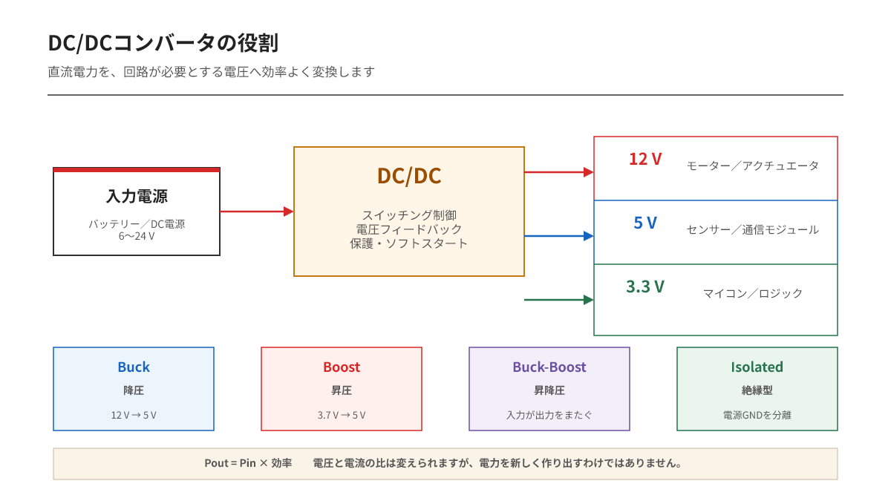
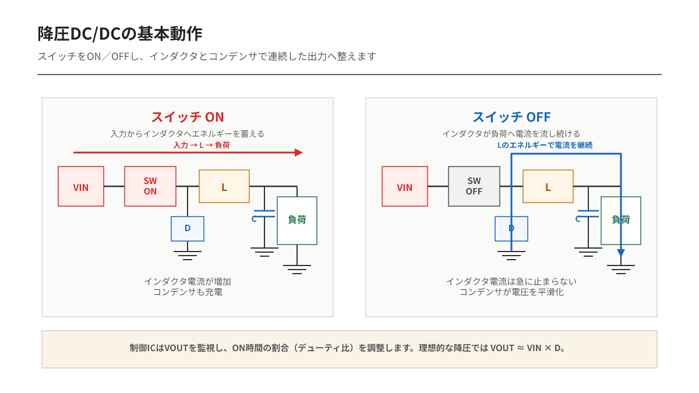

---
tags:
    - DC/DC
    - 電源回路
    - 降圧
    - 昇圧
    - スイッチング電源
---

# DC/DCコンバータの役割
## 直流電圧を、必要な電圧へ効率よく変換する

12 Vのバッテリーから、5 Vのセンサーと3.3 Vのマイコンを動かしたい。

抵抗で電圧を下げればよさそうに見えます。しかし負荷電流が変われば抵抗の電圧降下も変わり、出力電圧を一定に保てません。大きな電力を扱えば、抵抗で失われる電力はそのまま熱になります。

DC/DCコンバータの役割は、直流電力を別の直流電圧へ変換し、入力電圧や負荷が変化しても必要な出力を保つことです。

## 電圧を下げる、上げる、またぐ

DC/DCコンバータには複数の方式があります。

| 方式 | 入力と出力の関係 | 使用例 |
|---|---|---|
| Buck（降圧） | 出力電圧＜入力電圧 | 12 V→5 V、5 V→3.3 V |
| Boost（昇圧） | 出力電圧＞入力電圧 | 電池3.7 V→5 V |
| Buck-Boost（昇降圧） | 入力より高くも低くもできる | 電池電圧が出力電圧をまたぐ機器 |
| 絶縁型 | 電力を絶縁して伝える | 通信絶縁、産業機器、安全規格対応 |

単に電圧を小さくするだけなら降圧です。バッテリーの放電によって入力が出力より高い状態と低い状態をまたぐなら、昇降圧が必要になります。

方式は名前ではなく、入力電圧の最小値・最大値と必要な出力電圧の関係から選びます。

## DC/DCは電流を作り出しているのか

降圧すると、出力側で入力側より大きな電流を取り出せる場合があります。

それでも電力が増えたわけではありません。

理想的な変換では、

`Pin = Pout`

実際には損失があるため、

`Pout = Pin × η`

となります。`η`は効率です。

例えば12 Vから5 V・1 Aを作る場合、出力電力は5 Wです。効率90%なら、入力電流はおおよそ次の値になります。

`Iin = 5 W / (12 V × 0.9) ≈ 0.46 A`

入力側では約0.46 A、出力側では1 Aが流れます。電圧を下げた分だけ電流の比が変わりますが、損失を含めた入力電力の範囲内です。

DC/DCの電流定格は「常にその電流を押し出す」という意味でもありません。負荷が必要とする電流を供給できる上限です。

## なぜスイッチングすると効率が上がるのか

一般的なDC/DCは、MOSFETを高速にON／OFFする**スイッチングレギュレータ**です。

MOSFETを中途半端に導通させて電圧を落とすのではなく、

- ON：小さな電圧降下で電流を流す
- OFF：ほとんど電流を流さない

という2状態を使います。ON中は電圧損失を小さくし、OFF中は電流損失を小さくできるため、線形制御より損失を減らしやすくなります。

ただし、実際にはMOSFETのオン抵抗、スイッチング損失、インダクタの銅損・コア損、ダイオードや配線の損失があります。効率100%にはなりません。

## 降圧DC/DCの基本動作

降圧回路では、スイッチ、インダクタ、ダイオードまたは下側MOSFET、出力コンデンサを組み合わせます。

### スイッチON

入力電源からインダクタと負荷へ電流が流れます。インダクタ電流は増加し、磁界としてエネルギーを蓄えます。出力コンデンサも充電されます。

### スイッチOFF

インダクタ電流は瞬時にゼロへ変化できません。インダクタに蓄えられたエネルギーが、ダイオードや下側MOSFETを通して負荷へ流れ続けます。

出力コンデンサは電圧変動をならし、負荷電流の急な変化も一時的に支えます。

制御ICは出力電圧をフィードバックし、ON時間の割合を調整します。この割合がデューティ比です。理想的な連続導通の降圧回路では、

`Vout ≈ Vin × D`

となります。`D`がデューティ比です。

## LDOとの違い

DC/DCとLDOは、どちらも電源電圧を整える回路です。しかし得意な条件が違います。

| 項目 | DC/DC | LDO |
|---|---|---|
| 効率 | 高くしやすい | おおよそVout/Vinに制約される |
| 発熱 | 比較的小さい | 電圧差×電流が熱になりやすい |
| 昇圧 | 可能な方式あり | 不可 |
| 回路 | インダクタなどが必要 | 比較的単純 |
| リップル・ノイズ | スイッチング成分あり | 小さくしやすい |
| レイアウト | 重要 | 比較的容易 |

例えば12 Vから3.3 V・1 AをLDOで作ると、理想化してもLDOの損失は、

`Ploss = (12 V − 3.3 V) × 1 A = 8.7 W`

です。放熱が大きな問題になります。

一方、入力と出力の差が小さく、電流も小さく、低ノイズが重要ならLDOが適する場合があります。DC/DCで一度大きく降圧し、その後LDOでアナログ回路用の低ノイズ電源を作る構成も使われます。

## 出力電圧だけ合っていても不十分

DC/DCを選ぶとき、出力が5 Vならどれでもよいわけではありません。

### 入力電圧範囲

バッテリーや車載電源は一定ではありません。通常時だけでなく、充電中、始動時、回生、ケーブル降下、サージ保護後の電圧まで確認します。

### 連続電流とピーク電流

モーター、無線、CPUなどは瞬間的に大きな電流を要求します。平均電流だけで選ぶと、負荷変動時に電圧が低下してマイコンがリセットすることがあります。

### リップルと過渡応答

定常時のリップルが小さくても、負荷が急増した瞬間には出力電圧が下がります。出力コンデンサ、制御方式、補償、配線インピーダンスが関係します。

### 効率と温度

データシートの最大効率だけでなく、実際の入力電圧、出力電圧、負荷電流での効率曲線を確認します。

例えば出力10 W、効率90%なら損失は約1.1 Wです。

`Ploss = Pout × (1 / η − 1)`

この損失を基板の銅箔、パッケージ、空気へ逃がせるかを確認します。

### スイッチング周波数

周波数を上げるとインダクタやコンデンサを小さくしやすくなります。一方、スイッチング損失やEMIが増えやすくなります。

高い周波数が常に優れているわけではありません。

## レイアウトが回路の一部になる

DC/DCでは、スイッチング電流が流れるループを小さくすることが重要です。

- 入力コンデンサをICのVIN・GND近くに置く
- スイッチノードの銅箔面積を必要以上に広げない
- インダクタと出力コンデンサを近づける
- フィードバック配線をスイッチノードから離す
- パワーGNDと信号GNDの電流経路を意識する
- データシートの推奨レイアウトを優先する

同じ部品と回路図でも、レイアウトによってリップル、発熱、EMI、安定性が変わります。

ブレッドボードや長いジャンパ線は寄生成分が大きいため、高速なDC/DCの評価には向かないことがあります。

## 保護機能も役割の一部

多くのDC/DC ICは、電圧変換以外の機能を持っています。

- 過電流保護
- 短絡保護
- 過熱保護
- 低入力電圧ロックアウト
- 過電圧保護
- ソフトスタート
- Power Good出力
- Enable入力

ソフトスタートは出力コンデンサを急に充電する電流を抑え、入力電源の落ち込みを防ぎやすくします。Power Goodは、出力電圧が規定範囲に入ったことを後段回路へ知らせます。

## よくある誤解

| 誤解 | 実際 |
|---|---|
| DC/DCは電流を増幅する | 電力保存と効率の範囲で電圧と電流の比を変える |
| 5 A品は常に5 Aを流す | 負荷が必要とする電流を供給できる上限 |
| 出力電圧が合えば使える | 入力範囲、過渡応答、熱、リップルも必要 |
| 高周波ほど優れている | 小型化と損失・EMIのトレードオフ |
| DC/DCは必ずLDOより良い | 低ノイズ、小電流、小さな電圧差ではLDOが適する場合がある |
| 回路図どおりなら動く | 部品選定と基板レイアウトも動作に直結する |

## まとめ

DC/DCコンバータは、余った電圧を単純に捨てる回路ではありません。

スイッチとインダクタを使ってエネルギーを移し、入力条件と負荷が変化しても必要な電源レールを効率よく作ります。

その役割は次の三つにまとめられます。

- 必要な直流電圧へ変換する
- 発熱と電力損失を抑える
- 負荷変動や異常時にも電源を維持・保護する

12 Vから5 Vが出ていることだけでは、良い電源とは判断できません。負荷が変化した瞬間、基板が熱くなった状態、ノイズを出した状態でも、回路全体が必要とする電力を届けられることがDC/DCの仕事です。

## 参考資料

- [Analog Devices：Advantages of Switching Regulators Over Linear Regulation](https://www.analog.com/en/resources/technical-articles/advantages-of-switching-regulators-over-linear-regulation.html)
- [Analog Devices AN-140：Basic Concepts of Linear Regulator and Switching Mode Power Supplies](https://www.analog.com/en/resources/app-notes/an-140.html)
- [Texas Instruments：Switching Regulator Fundamentals](https://www.ti.com/lit/an/snva559c/snva559c.pdf)

