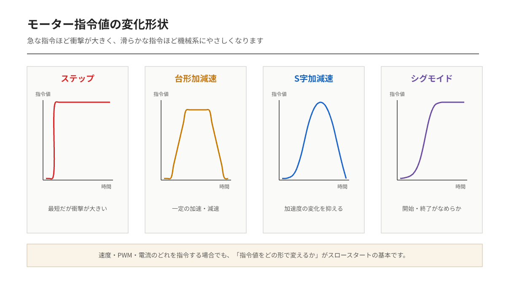
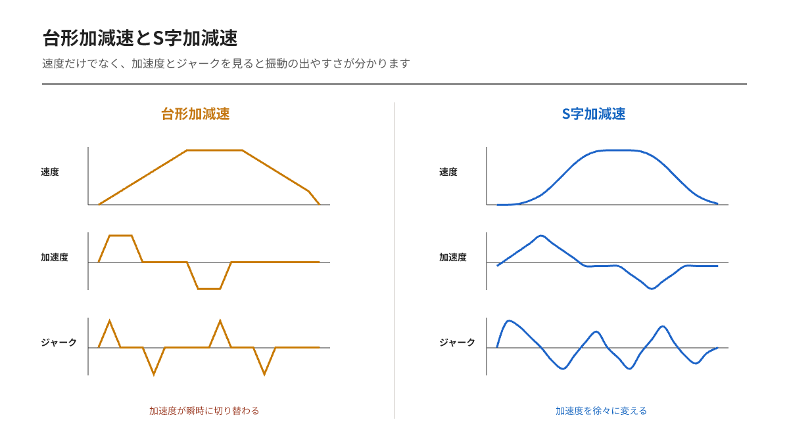
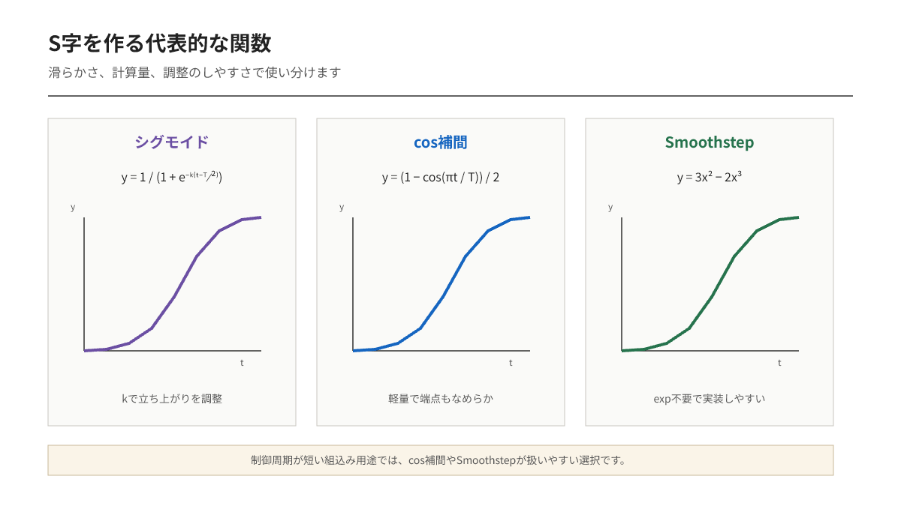

---
tags:
    - 開発資料
    - MCU
    - 用語解説
---

# DCモーターのスロースタート  
## 台形・S字・シグモイドによる指令値の変化

DCモーターに、停止状態からいきなり最大出力を与える。

すると、モーターは素早く動き始めます。しかし、その「素早さ」が必ずしも良いとは限りません。大きな突入電流が流れ、機構には衝撃が加わり、タイヤが滑ったり、ベルトやギアが振動したりすることがあります。

そこで、モーターへの指令値を少しずつ増加させます。

これが**スロースタート**です。

## スロースタートとは

スロースタートとは、モーターのPWMデューティ比や電圧指令、速度指令などを、目標値まで徐々に変化させる制御です。

例えば、PWM指令を次のように瞬間的に変化させるのではなく、

```text
0% → 100%
```

時間をかけて変化させます。

```text
0% → 10% → 20% → 30% → … → 100%
```

これにより、次のような効果が期待できます。

- 起動時の大電流を抑える
- ギアやベルトに加わる衝撃を小さくする
- タイヤの空転を抑える
- 機体の急な揺れを抑える
- 電源電圧の低下やリセットを防ぎやすくする

ただし、指令値をゆっくり変えれば、それだけで滑らかになるとは限りません。

指令値の**変化の形**も重要です。



## ステップ状の指令

最も単純なのは、目標値をそのまま出力する方法です。

このような指令を**ステップ入力**と呼びます。

実装は簡単です。

```c
motor_output = target_output;
```

しかし、指令値が一瞬で変化するため、モーターには大きな加速度が要求されます。

実際のモーターは一瞬で目標速度には到達できません。その代わり、大きな電流を流して強いトルクを発生させようとします。

その結果、機械的にも電気的にも負担が大きくなります。

## 台形状の速度指令

最も実装しやすいスロースタートが、指令値を一定の割合で増加させる方法です。

減速も含めると、速度指令の形が台形に見えるため、**台形速度制御**や**台形加減速**と呼ばれます。

加速中は、指令値を一定量ずつ増加させます。

```c
if (current_output < target_output) {
    current_output += step;
}
```

例えば、制御周期が `10 ms`、1回あたりの増加量が `1%` の場合、0%から100%まで約1秒かかります。

```text
10 ms × 100回 = 1000 ms
```

ただし、このコードだけでは目標値を超える可能性があります。

```c
if (current_output < target_output) {
    current_output += step;

    if (current_output > target_output) {
        current_output = target_output;
    }
}
```

減速にも対応する場合は、次のようにします。

```c
void updateMotorOutput(void)
{
    if (current_output < target_output) {
        current_output += step;

        if (current_output > target_output) {
            current_output = target_output;
        }
    }
    else if (current_output > target_output) {
        current_output -= step;

        if (current_output < target_output) {
            current_output = target_output;
        }
    }
}
```

この処理は、指令値の変化量を制限しているため、**レートリミッタ**とも呼ばれます。

## 台形制御でも衝撃が残る理由

台形制御では、速度は徐々に変化します。

それなら、十分滑らかに見えます。

しかし、加速を始める瞬間を見ると、加速度は突然0から一定値へ変化しています。



速度は連続していても、加速度は急に変化しています。

この加速度の変化率を**ジャーク**と呼びます。

```text
ジャーク = 加速度の時間変化率
```

台形制御では、加速開始時と加速終了時に大きなジャークが発生します。

低速の小型モーターでは問題にならないことも多いですが、次のような機構では振動として現れることがあります。

- 重い物体を動かす機構
- 長いアーム
- ベルト駆動機構
- バックラッシの大きいギア
- 滑りやすいタイヤ
- 高速で往復する機構

そこで、加速度そのものも徐々に変化させます。

## S字加減速

加速度を急に切り替えず、少しずつ増減させる方法が**S字加減速**です。

速度をグラフにすると、始めと終わりが丸くなったS字状の曲線になります。



開始直後はゆっくり加速します。

その後、加速度を大きくして速度を上げ、目標値に近づいたところで再び加速度を小さくします。

台形制御との違いは、加速度の変化にあります。

### 台形加減速

```text
速度      直線的に増加
加速度    急に0から一定値へ変化
ジャーク  切り替え時に大きくなる
```

### S字加減速

```text
速度      始めと終わりが滑らか
加速度    徐々に増加・減少
ジャーク  制限しやすい
```

S字加減速は、機械的な振動や衝撃を抑えたい場合に有効です。

ただし、台形制御より計算と実装が複雑になります。

## シグモイド関数を使ったスロースタート

S字状の指令値を作る方法の一つが、**シグモイド関数**です。

代表的なシグモイド関数は、ロジスティック関数です。

```text
f(t) = 1 / (1 + exp(-k(t - t0)))
```

各変数は次の意味を持ちます。

- `t`：経過時間
- `t0`：変化の中央となる時刻
- `k`：曲線の急さ
- `f(t)`：0から1の間で変化する値

この値に目標出力を掛けます。

```text
出力 = 目標出力 × f(t)
```

シグモイド関数は、開始直後と終了直前の変化が小さく、中央付近で大きく変化します。

例えばC言語では、次のように計算できます。

```c
#include <math.h>

float sigmoid(float time, float center, float steepness)
{
    return 1.0f / (1.0f + expf(-steepness * (time - center)));
}
```

目標PWMに適用する場合は、次のようになります。

```c
float ratio = sigmoid(elapsed_time, 1.0f, 6.0f);
float motor_output = target_output * ratio;
```

この例では、約1秒の位置を中心として出力が変化します。

`steepness`を大きくすると、中央付近で急激に変化します。

```text
kが小さい → ゆっくり変化する
kが大きい → 急激に変化する
```

## シグモイド関数の注意点

ロジスティック関数は、数学上では完全に0にも1にもなりません。

時間が十分に小さいと0に近づき、十分に大きいと1に近づきますが、厳密には到達しません。

そのため、実際の制御では開始時刻と終了時刻に合わせて正規化するか、一定時間が経過したら目標値を直接代入します。

```c
if (elapsed_time >= ramp_time) {
    motor_output = target_output;
}
else {
    float ratio = calculateSigmoidRatio(elapsed_time);
    motor_output = target_output * ratio;
}
```

また、マイコンによっては指数関数 `expf()` の計算負荷が大きくなることがあります。

制御周期が短い場合や、多数のモーターを制御する場合は注意が必要です。

## cos関数を使った簡単なS字指令

厳密にシグモイド関数を使わなくても、cos関数を利用すると、0から1まで滑らかに変化する曲線を作れます。

```text
f(t) = (1 - cos(πt)) / 2
```

ここで、`t`は0から1の範囲です。

- `t = 0` のとき `f(t) = 0`
- `t = 1` のとき `f(t) = 1`
- 開始時と終了時の傾きが0になる

実装例は次のとおりです。

```c
#include <math.h>

float smoothStepCos(float progress)
{
    if (progress <= 0.0f) {
        return 0.0f;
    }

    if (progress >= 1.0f) {
        return 1.0f;
    }

    return 0.5f - 0.5f * cosf((float)M_PI * progress);
}
```

経過時間から進行度を計算します。

```c
float progress = elapsed_time / ramp_time;
float ratio = smoothStepCos(progress);

motor_output = target_output * ratio;
```

この方法は、指定した時間で必ず0から1まで変化します。

ロジスティック関数より扱いやすいため、単純なスロースタートでは有力な選択肢です。

## Smoothstepを使う方法

乗算だけでS字曲線を作る方法もあります。

よく使われるのが、次の`Smoothstep`です。

```text
f(t) = 3t² - 2t³
```

`t`は0から1の範囲に制限します。

```c
float smoothStep(float progress)
{
    if (progress <= 0.0f) {
        return 0.0f;
    }

    if (progress >= 1.0f) {
        return 1.0f;
    }

    return progress * progress * (3.0f - 2.0f * progress);
}
```

指数関数や三角関数を使わないため、比較的軽い計算で実装できます。

```c
float progress = elapsed_time / ramp_time;
float ratio = smoothStep(progress);

motor_output = target_output * ratio;
```

開始時と終了時の傾きが0になるため、単純な直線補間より滑らかに動作します。

## 各方式の比較

| 方式 | 指令値の形 | 滑らかさ | 計算量 | 実装難易度 |
|---|---|---:|---:|---:|
| ステップ入力 | 瞬間的に変化 | 低い | 小さい | 簡単 |
| 台形加減速 | 直線的に変化 | 中程度 | 小さい | 簡単 |
| Smoothstep | S字 | 高い | 小さい | 普通 |
| cos補間 | S字 | 高い | やや大きい | 普通 |
| シグモイド | S字 | 高い | 大きい | やや難しい |
| ジャーク制限S字 | 加速度まで設計 | 非常に高い | 大きい | 難しい |

単にDCモーターの起動電流や衝撃を抑えたい場合は、まず台形加減速で十分なことが多いです。

台形加減速で振動が残る場合は、`Smoothstep`やcos補間によるS字指令を試します。

シグモイド関数は曲線の形を調整しやすい一方で、終了時刻や計算負荷を意識する必要があります。

## PWM指令と速度指令の違い

スロースタートを入れる場所によって、動作の意味が変わります。

### PWM指令を徐々に増やす場合

```text
PWMデューティ比
0% → 100%
```

実装は簡単ですが、PWMとモーター速度の関係は一定ではありません。

負荷や電源電圧によって、同じPWMでも速度が変化します。また、PWMが小さい範囲では静止摩擦に負けてモーターが回らないことがあります。

例えば、PWMが20%になるまで停止し、その後突然動き始める可能性があります。

### 速度指令を徐々に増やす場合

```text
目標速度
0 rpm → 1000 rpm
```

速度制御器に渡す目標値を徐々に変化させます。

エンコーダを使ったフィードバック制御では、こちらの方が速度変化を設計しやすくなります。

ただし、速度PID制御の出力が飽和すると、設定した加速曲線どおりに動かないことがあります。

## 最小PWMに注意する

DCモーターには、PWMを少し与えただけでは回転しない領域があります。

例えば、PWMが0〜15%では停止し、16%を超えたところで動き始めるモーターを考えます。

そのまま0%から滑らかに増やしても、実際の動きは滑らかになりません。

```text
指令値    滑らかに増加
実速度    しばらく停止してから動き始める
```

この場合は、モーターが回転を開始する最小出力を考慮します。

```c
float applyMinimumOutput(float output)
{
    const float minimum_output = 0.16f;

    if (output > 0.0f && output < minimum_output) {
        return minimum_output;
    }

    if (output < 0.0f && output > -minimum_output) {
        return -minimum_output;
    }

    return output;
}
```

ただし、最初から最小PWMを与えるため、その分だけ小さな衝撃は残ります。

速度センサを使用できる場合は、PWM値だけでなく実際の速度を確認しながら調整します。

## 制御周期を使った実装例

制御ループが一定周期で実行される場合は、1回あたりの増加量ではなく、1秒あたりの変化量で考えると設定しやすくなります。

```c
float updateRamp(
    float current,
    float target,
    float rate_per_second,
    float delta_time)
{
    float max_change = rate_per_second * delta_time;

    if (target > current) {
        current += max_change;

        if (current > target) {
            current = target;
        }
    }
    else if (target < current) {
        current -= max_change;

        if (current < target) {
            current = target;
        }
    }

    return current;
}
```

使用例です。

```c
const float control_period = 0.01f;
const float output_rate = 1.0f;

motor_output = updateRamp(
    motor_output,
    target_output,
    output_rate,
    control_period
);
```

`output_rate = 1.0`の場合、正規化された出力が1秒間に1.0変化します。

つまり、0から100%まで約1秒です。

制御周期が変化しても、`delta_time`を正しく渡せば、加速時間はほぼ一定になります。

## どの方式を使うべきか

まず試すなら、台形加減速が適しています。

実装が簡単で、加速時間や減速時間の意味も分かりやすいためです。

```text
単純な起動電流対策
    → 台形加減速

台形加減速で振動が出る
    → Smoothstepまたはcos補間

加速度やジャークを厳密に管理したい
    → ジャーク制限付きS字加減速
```

シグモイド関数はS字曲線の代表例ですが、S字加減速そのものが必ずシグモイド関数である必要はありません。

`Smoothstep`やcos補間も、開始時と終了時を滑らかにつなぐS字指令として利用できます。

## まとめ

スロースタートは、DCモーターへの指令値を時間をかけて変化させる方法です。

最も単純な台形加減速では、指令値を一定速度で増減させます。実装しやすく、多くの場合はこれだけでも起動時の衝撃を軽減できます。

それでも振動が残る場合、問題は速度ではなく、加速度が突然切り替わっていることにあります。

S字加減速では、加速度も徐々に変化させます。シグモイド、cos補間、Smoothstepなどは、そのS字状の指令値を作る方法です。

機構に瞬間的な負荷をかけたくない、急停止や急加速を避けたい場合は、スロースタートを使ってみてください。