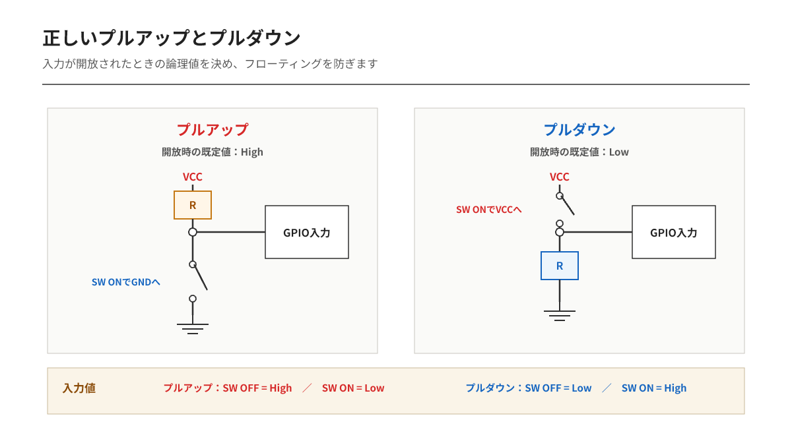
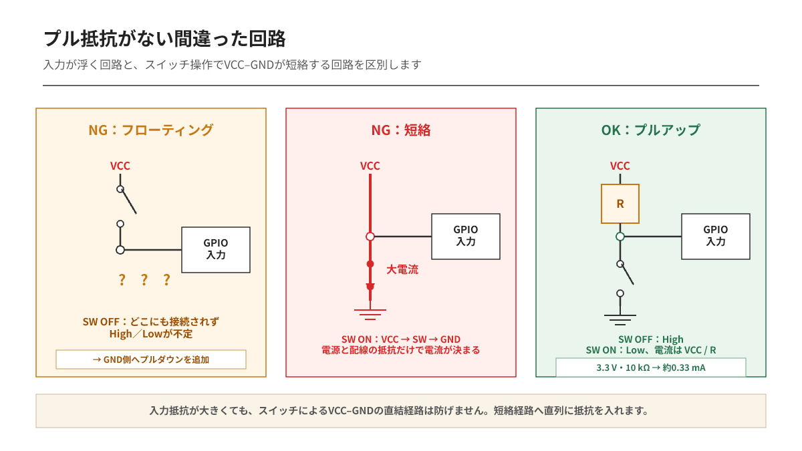
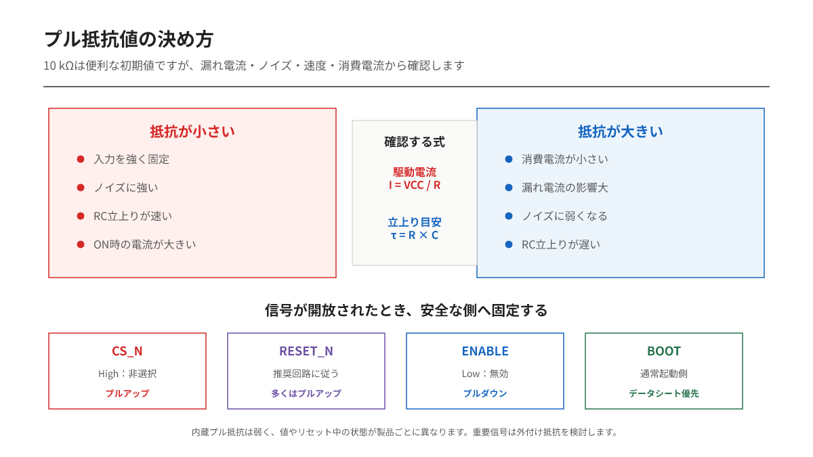

---
tags:
    - GPIO
    - プルアップ
    - プルダウン
    - 電子回路
    - 入門
---

# 正しいプルアップとプルダウン
## 入力を浮かせず、安全な初期状態を作る

スイッチをGPIO入力へ接続したのに、押していないときの値がHighになったりLowになったりする。

配線が切れているようにも見えますが、入力ピンがどこにも接続されていないなら、その動作は不思議ではありません。GPIO入力は周囲のノイズや漏れ電流を受け、論理値が定まらない**フローティング状態**になります。

プルアップ抵抗とプルダウン抵抗の第一の役割は、入力に何も接続されていない時間の論理値を決めることです。

## 入力ピンは「何もつながっていないからLow」ではない

デジタル入力は、入力電圧がHigh判定範囲にあれば1、Low判定範囲にあれば0として読み取ります。

ところが開放された入力ピンには、HighにもLowにも固定する経路がありません。高インピーダンスであるため、人体、配線、隣の信号線、静電気などの小さな影響でも電圧が変化します。

フローティング入力には、主に次の問題があります。

- 読み取るたびに値が変わる
- 外来ノイズで誤動作する
- 入力しきい値付近に留まり、内部回路の消費電流が増える
- 割り込み入力なら、意図しない割り込みが発生する

STMicroelectronicsのGPIO資料でも、信号のないフローティング入力は外来ノイズによりシュミットトリガが不規則に切り替わり、消費電力が増える可能性が示されています。

## 間違った回路

プル抵抗が必要な理由は、間違った回路と比べると分かりやすくなります。

### スイッチOFFで入力が浮く

VCC、スイッチ、GPIO入力を直列につないだだけの回路では、スイッチON時にHighを読み取れます。

問題はスイッチOFFです。

スイッチが開くとGPIO入力はVCCから切り離され、GNDにも接続されません。この状態ではLowになるのではなく、HighにもLowにも固定されないフローティング入力になります。

この回路にプルダウン抵抗を追加すれば、スイッチOFF時はLow、ON時はHighとして安定します。

### スイッチONでVCCとGNDが短絡する

GPIO入力をVCCへ直接つなぎ、同じ入力点からスイッチでGNDへ接続する回路も危険です。

スイッチOFF時はHighを読み取れます。しかしスイッチをONにすると、

`VCC → スイッチ → GND`

という低抵抗の経路ができます。GPIO入力の入力抵抗が大きくても、短絡電流は入力ピンではなくスイッチ側の経路を流れるため、短絡防止にはなりません。

理想回路では抵抗が0 Ωなら電流は無限大になります。実際の回路では電源、配線、スイッチの抵抗で制限されますが、大電流による電圧低下、発熱、接点損傷、電源保護動作、基板パターン損傷を起こす可能性があります。

VCCと入力点の間にプルアップ抵抗を入れれば、スイッチON時の電流は、

`I = VCC / R`

で制限されます。3.3 V、10 kΩなら約0.33 mAです。

抵抗には二つの役割があります。

- スイッチOFF時の入力値をHighまたはLowへ固定する
- スイッチON時にVCCとGNDの間を流れる電流を制限する

## プルアップ回路

プルアップでは、入力ピンを抵抗を介してVCCへ接続します。スイッチは入力ピンとGNDの間に置きます。

- スイッチOFF：抵抗によってHigh
- スイッチON：GNDへ接続されてLow

スイッチを押したときに0になるため、**アクティブLow**の入力です。

スイッチON時にはVCCから抵抗、スイッチ、GNDへ電流が流れます。電流はおおよそ次の式で求められます。

`I = VCC / R`

3.3 Vで10 kΩなら、約0.33 mAです。

抵抗があるため、スイッチを押してもVCCとGNDが直接短絡しません。抵抗は入力の既定値を作ると同時に、スイッチON時の電流を制限しています。

## プルダウン回路

プルダウンでは、入力ピンを抵抗を介してGNDへ接続します。スイッチはVCCと入力ピンの間に置きます。

- スイッチOFF：抵抗によってLow
- スイッチON：VCCへ接続されてHigh

スイッチを押したときに1になるため、**アクティブHigh**の入力です。

プルアップとプルダウンは、どちらもフローティングを防ぎます。違うのは、外部信号がないときの既定値です。

## どちらを選ぶべきか

「スイッチだからプルアップ」と機械的に決めるのではなく、入力が開放されたときに安全な状態を選びます。

| 信号例 | 推奨される既定状態の例 | 抵抗 |
|---|---|---|
| `RESET_N` | 非リセットのHigh | プルアップ |
| `CS_N` | 非選択のHigh | プルアップ |
| `ENABLE` | 無効のLow | プルダウン |
| モーター許可入力 | 停止側 | 回路の論理に合わせる |
| ブート設定ピン | 起動したいモード | データシートに従う |

信号名の末尾に`_N`、`#`、バー記号が付く信号は、Lowが有効であることがよくあります。このような信号は、開放時に誤って有効にならないようHighへプルアップする設計が多くなります。

ただしRESETやBOOTなどの専用ピンは、電源投入時のタイミングや内部抵抗が規定されています。一般則よりデータシートの推奨回路を優先します。

## 抵抗値は10 kΩで固定ではない

10 kΩはスイッチ入力でよく使われる値ですが、すべての回路の正解ではありません。

抵抗が小さい場合は、入力を強くHighまたはLowへ固定できます。ノイズや漏れ電流の影響を受けにくく、配線容量とのRC時定数も小さくなります。一方、スイッチやオープンドレイン出力が反対側へ駆動している間の電流は増えます。

抵抗が大きい場合は消費電流を減らせます。しかし漏れ電流による電圧変化が大きくなり、長い配線や容量の大きい入力では立上り・立下りも遅くなります。

### 漏れ電流から上限を考える

プルアップ抵抗では、最悪時の漏れ電流による電圧降下を考えます。

`Rpull-up ≤ (VCC − VIH(min)) / Ileak(max)`

プルダウン抵抗では、漏れ電流で入力電圧が上昇してもLow判定範囲に収まるようにします。

`Rpull-down ≤ VIL(max) / Ileak(max)`

実際には、入力ピンだけでなく、接続IC、基板汚れ、コネクタ、保護回路などの漏れ電流も加算します。

### 駆動時の電流から下限を考える

スイッチまたは出力が抵抗の反対側へ駆動したときは、抵抗に電流が流れます。

`R ≥ VCC / Iallow`

許容電流には、スイッチ接点、外部ICのLow出力能力、消費電力の要求を反映します。

つまり抵抗値は、

- 大きすぎると入力が弱くなる
- 小さすぎると駆動電流が増える

という両側の条件から決めます。

## 内蔵プルアップ／プルダウンの注意点

多くのマイコンはGPIOに弱い内蔵プルアップ／プルダウンを持っています。部品を減らせるため、短い基板配線のボタン入力などでは便利です。

ただし、内蔵抵抗には次の注意があります。

- 抵抗値のばらつきが大きい
- マイコンやピンによって使用可否が異なる
- リセット中や電源投入直後の状態が通常動作時と異なる
- 電源OFF時には入力状態を保持できない
- 長い配線や強いノイズ環境では弱すぎる場合がある
- ADCなどアナログ入力では測定値へ影響する

STM32の資料では内部抵抗の代表例として約40 kΩが示されていますが、全製品で同じ値ではありません。最小値と最大値、リセット時の状態は、使用するマイコンのデータシートを確認します。

起動モード、チップセレクト、パワー回路のEnableなど、リセット中にも状態を保証したい信号には外付け抵抗が適しています。

## 出力ピンにも付ければ安全なのか

プル抵抗は主に、入力またはHigh-Zになる可能性がある信号へ使用します。

通常のプッシュプル出力は、自分でHighとLowの両方を駆動します。この出力へ別電圧のプルアップ抵抗を付けてレベル変換しようとすると、出力回路や別電源へ電流が流れる可能性があります。

一方、オープンドレイン出力はHighを駆動できないため、外部プルアップが必要です。I2CのSDAとSCLが代表例です。

同じプルアップでも、スイッチ入力の既定値を作る場合と、オープンドレイン信号をHighへ戻す場合では、抵抗値を決める条件が異なります。

## 電源OFF時の電流経路にも注意する

外部プルアップ先の電源がONで、入力されるマイコンの電源がOFFという状態では、入力保護回路を通してマイコン側へ電流が流れ込むことがあります。

これはバックパワー、逆給電と呼ばれる問題につながります。

- 入力ピンが電源OFF時に電圧印加可能か
- 注入電流の最大定格
- I/O電源とプルアップ電源の投入順序
- 5 Vトレラント条件

これらをデータシートで確認します。「抵抗を入れたから安全」とは限りません。

## よくある間違い

| 間違い | 問題 |
|---|---|
| 開放入力はLowになると思う | 入力がフローティングする |
| VCCとGNDをスイッチで直接つなぐ | 短絡電流が流れる |
| どんな入力にも10 kΩを使う | 漏れ電流、速度、消費電力を確認していない |
| 内蔵抵抗の値を正確な抵抗として使う | ばらつきが大きい |
| 内蔵プルだけで起動状態を保証する | リセット中に無効な可能性がある |
| プッシュプル出力へ別電圧をプルアップする | 逆流や過電圧の可能性がある |

## まとめ

正しいプルアップ／プルダウンは、単に入力をHighかLowへ寄せる回路ではありません。

- 外部信号がないときの論理値を決める
- フローティングによる誤動作と消費電流増加を防ぐ
- スイッチやオープンドレイン動作時の電流を制限する
- 起動時や断線時に安全な状態を作る

選択の基準は、「抵抗を上に置くか下に置くか」ではなく、信号が開放された瞬間に回路をどちらの状態へ倒すべきかです。

## 参考資料

- [Qiita：プルアップ回路とプルダウン回路とは？](https://qiita.com/nishiwakki/items/e921d44a00a37c72979c)
- [STMicroelectronics AN4899：GPIO hardware settings and low-power consumption](https://www.st.com/resource/en/application_note/dm00315319-stm32-gpio-configuration-for-hardware-settings-and-low-power-consumption-stmicroelectronics.pdf)
- [Texas Instruments：Designing with voltage translators／Pull-up resistors](https://www.ti.com/lit/an/slva746/slva746.pdf)
