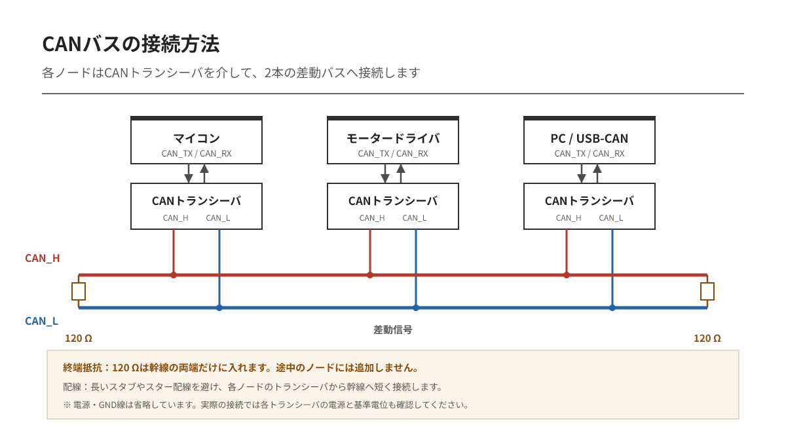
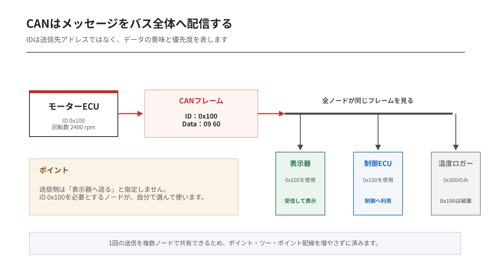
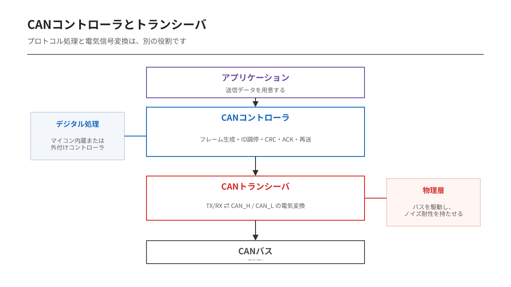

---
tags:
    - CAN
    - CAN FD
    - 通信
    - 入門
---

# CAN / CAN FD入門 第1編
## 2本の通信線を、複数の機器で共有できる理由

複数のマイコンに、同じセンサー値を届けたい。

UARTだけで構成しようとすると、送信相手ごとに配線やポートが必要になります。機器が増えるほど線も増え、誰が誰へ送るのかという管理も複雑になります。

CANでは考え方が違います。CAN_HとCAN_Lという2本の通信線を複数のノードで共有し、メッセージをバス全体へ流します。

ここでいう**ノード**は、CANバスへ接続されたECU、マイコン基板、センサー、アクチュエーターなどです。

## CANは「相手」ではなく「情報」にIDを付ける

CANのIDは、送信先の機器番号ではありません。

例えば次のように、メッセージの意味へIDを割り当てます。

| CAN ID | メッセージの意味 | 使用するノード |
|---|---|---|
| `0x100` | モーター回転数 | 表示器、制御ECU |
| `0x180` | バッテリー電圧 | 制御ECU、ロガー |
| `0x300` | 温度 | ファン制御、表示器 |

送信ノードは、IDとデータをまとめてバスへ送ります。すべてのノードがそのフレームを受信できますが、実際に使用するかどうかは受信フィルターやソフトウェアが判断します。

この方式は**メッセージ指向**、または**内容指向アドレッシング**と呼ばれます。

一つの送信を複数のノードが同時に利用できる。これがCANの配線を単純にできる理由です。

## すべてのノードが送信を開始できる

CANには固定されたマスターがありません。バスが空いていれば、どのノードも送信を開始できます。

これは**マルチマスター方式**です。

ただし、2台が同時に送信を始める可能性があります。ここで単純にデータが衝突するなら、通信は不安定になります。CANはIDを1ビットずつ比較し、優先度の高いフレームだけを残します。

重要なのは、衝突してから両方を破棄するのではないことです。

優先度の高いフレームは壊れず、そのまま送信を続けます。優先度の低いノードは送信を止め、バスが空いた後に再度送信します。この仕組みを**非破壊ビット単位調停**と呼びます。

## マイコンだけではCANバスへ接続できない

「CAN対応マイコン」と書かれていても、CAN_HとCAN_Lへ直接接続できるとは限りません。

CAN通信は、主に次の2段に分かれています。

- **CANコントローラ**：ID、フレーム、CRC、調停、ACK、エラー処理を扱う
- **CANトランシーバ**：マイコン側のTX/RX信号をCAN_H/CAN_Lの電気信号へ変換する

CANコントローラは通信規則を担当し、トランシーバは実際の配線を駆動します。STM32などでCAN周辺回路が内蔵されていても、通常は外付けのCANトランシーバが必要です。

## CANが得意なこと

CANは、次のような用途に向いています。

- 複数ノードが同じ情報を利用する
- 重要な情報を優先して送る
- ノイズのある環境で通信する
- 通信異常をハードウェアで検出する
- ノードを追加しても基本配線を大きく変えない

一方、CAN IDだけでは「どのバイトが温度か」「単位は何か」「送信周期はいくつか」までは決まりません。これらはシステム設計者が通信仕様として定義します。

CANは通信の土台です。データの意味まで自動的に決めてくれる規格ではありません。

## この編の要点

- CANはCAN_HとCAN_Lを複数ノードで共有する
- IDは送信先ではなく、メッセージの内容と優先度を表す
- すべてのノードが送信できるマルチマスター方式
- CANコントローラとCANトランシーバは役割が異なる
- 同時送信はIDによる調停で解決する

2本の線でノイズに強い通信ができる理由は、CAN_HとCAN_Lの「電圧差」にあります。
