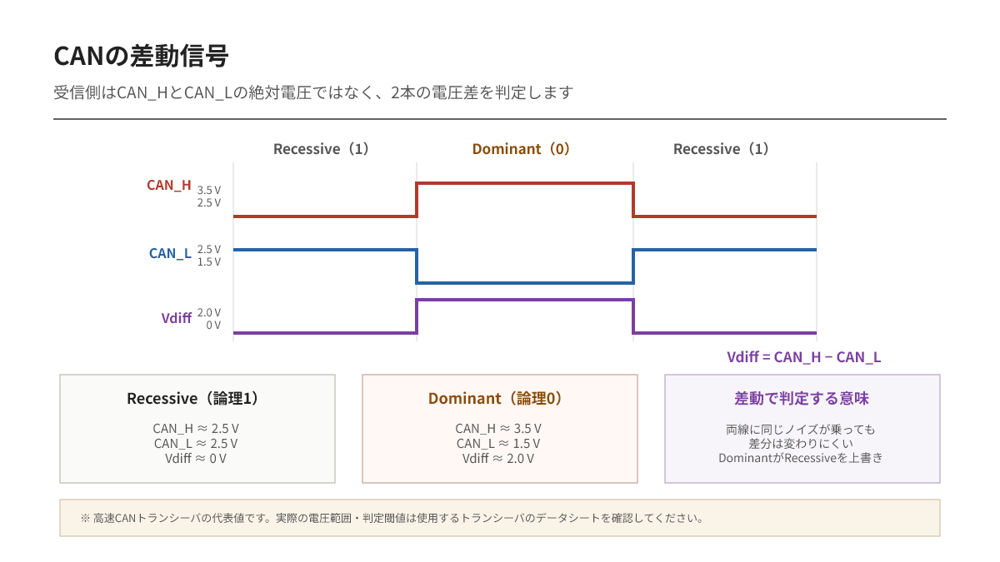
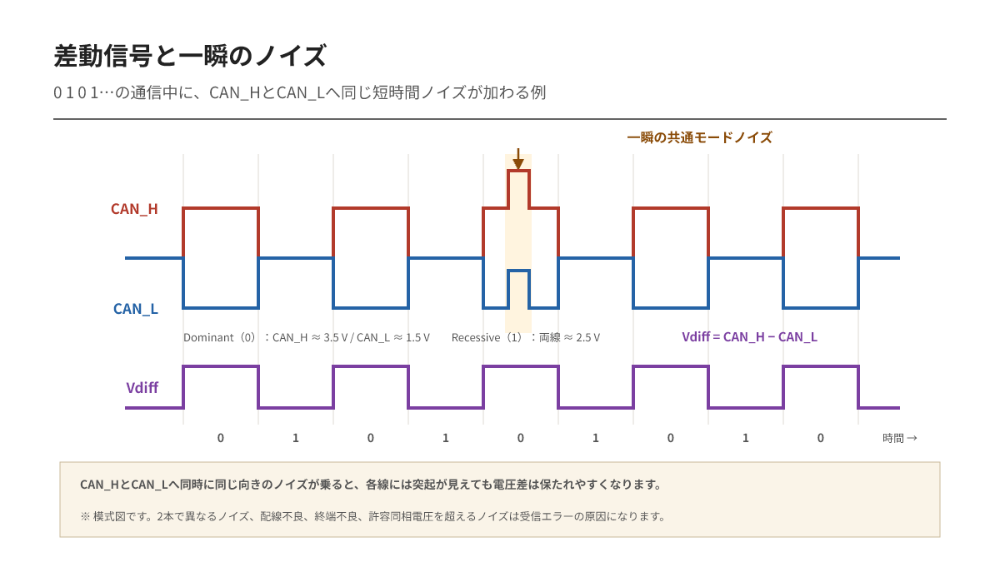
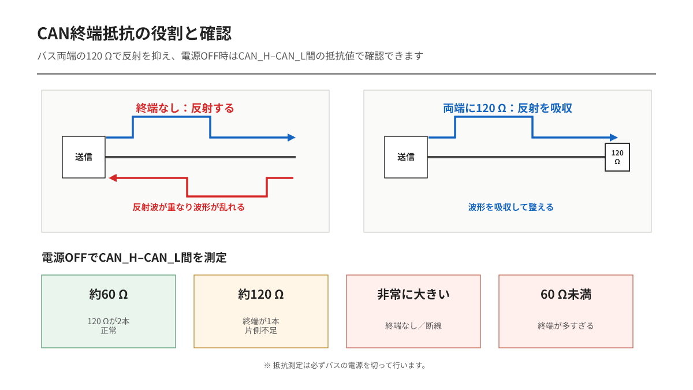

---
tags:
    - CAN
    - 物理層
    - 差動信号
    - 終端抵抗
---

# CAN / CAN FD入門 第2編
## CAN_HとCAN_L――差動信号と配線の基本

CANの論理値は、1本の線の電圧だけでは決まりません。

CAN_HとCAN_Lの**電圧差**を使って判定します。外来ノイズが両方の線へほぼ同じように加わっても、2本の差は変化しにくいためです。

## ドミナントとレセシブ

CANでは論理値を、High／Lowではなく次の名前で表します。

| 論理値 | CANでの名称 | バスの状態 |
|---|---|---|
| 0 | ドミナント | CAN_HとCAN_Lの差が大きい |
| 1 | レセシブ | CAN_HとCAN_Lの差が小さい |

代表的なHigh-speed CANでは、レセシブ時にCAN_HとCAN_Lがともに約2.5 V付近となり、ドミナント時にはCAN_Hが上昇し、CAN_Lが低下します。受信側は個々の電圧ではなく、主に両者の差を見ます。

実際の電圧範囲はトランシーバと規格条件で変わります。測定値が代表値から少し外れただけで、直ちに故障とは判断できません。

## なぜドミナントが優先されるのか

複数のノードが同時に送信した場合、あるノードがレセシブを送り、別のノードがドミナントを送ることがあります。このときバスはドミナントになります。

これはI2Cのオープンドレインに似た「優先される状態」を持つ考え方です。この性質があるため、各ノードは自分の送信値と実際のバスを比較しながら調停できます。

レセシブを送ったのにバスがドミナントなら、自分より優先度の高い送信が存在すると分かります。

## 同じノイズが乗っても差は変わりにくい

例えばCAN_HとCAN_Lの両方へ、一瞬だけ+1 Vのノイズが乗ったとします。

個々の電圧は変化します。しかし両方がほぼ同じ量だけ変化すれば、

`CAN_H − CAN_L`

の差は大きく変わりません。

この効果を得るには、2本の線が似た経路を通ることが重要です。そのためCAN_HとCAN_Lには、一般にツイストペア線を使用します。

## 配線は「幹線」と「短い支線」で考える

High-speed CANでは、一本の幹線の両端に終端抵抗を置き、各ノードは短い支線で接続する構成が基本です。

支線が長い、分岐が多い、スター配線になっている。こうした配線は、特に通信速度が高いほど反射や波形乱れを起こしやすくなります。

重要なのはノード数だけではありません。

- 幹線の全長
- 支線の長さ
- ケーブルの特性インピーダンス
- コネクタや基板配線
- ビットレート
- サンプルポイント

これらが一つの伝送路を作ります。

## 終端抵抗は各ノードに付けるものではない

一般的なHigh-speed CANでは、バスの物理的な両端へ120 Ωを1本ずつ接続します。

電源を切った状態でCAN_HとCAN_L間を測ると、120 Ωが2本並列になるため、正常な構成では約60 Ωになります。

| 測定値の目安 | 考えられる状態 |
|---|---|
| 約60 Ω | 120 Ωの終端が2本 |
| 約120 Ω | 終端が1本だけ |
| 非常に大きい | 終端なし、または断線 |
| 60 Ωより小さい | 終端が多すぎる可能性 |

測定は必ずバスの電源を切って行います。

## GNDは不要なのか

CANは差動信号ですが、接続機器間の基準電位差が無制限に許されるわけではありません。トランシーバには同相電圧範囲があり、それを外れると正常に受信できない可能性があります。

同一装置内や非絶縁構成では、CAN_H、CAN_Lに加えて信号基準となるGNDも配線するのが一般的です。絶縁CANでは、絶縁電源やシールド、接地方法を含めて別途設計します。

「差動だからGNDは絶対に不要」とは言い切れません。

## この編の要点

- CANはCAN_HとCAN_Lの差で信号を判定する
- 0がドミナント、1がレセシブ
- ツイストペアにより両線へ同じノイズが乗りやすくなる
- High-speed CANはライン型配線と両端120 Ωが基本
- 電源OFFでCAN_H–CAN_L間が約60 Ωなら終端2本の目安になる

