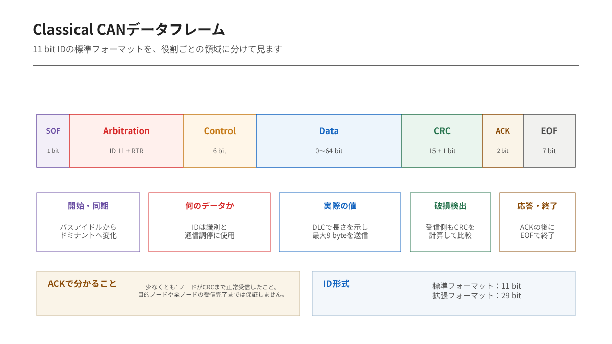
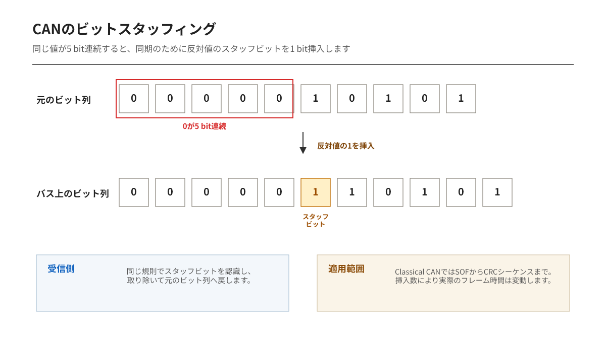

---
tags:
    - CAN
    - CANフレーム
    - CRC
    - ACK
    - ビットスタッフィング
---

# CAN / CAN FD入門 第3編
## CANフレームを分解して読む

オシロスコープでCANバスを見ると、0と1が連続しているだけに見えます。

ところがCANコントローラは、その並びを開始、ID、データ、検査、応答、終了という領域に分けて処理しています。このまとまりが**CANフレーム**です。

## データフレームの主な領域

初心者が最初に覚えるべきなのは、データフレームです。

| 領域 | 主な役割 |
|---|---|
| SOF | フレーム開始と同期 |
| Arbitration | IDとRTR。優先順位の判定に使用 |
| Control | フォーマット情報とDLC |
| Data | 実際に送りたいデータ |
| CRC | フレーム破損の検出 |
| ACK | 正常受信できたノードが応答 |
| EOF | フレーム終了 |

すべてを一度に暗記する必要はありません。

まず、IDは「何のデータか」、DLCは「何バイトか」、Dataは「値そのもの」、CRCとACKは「正しく届いたか」に関係すると捉えると、フレーム全体が読みやすくなります。

## 標準IDと拡張ID

Classical CANには主に2種類のID形式があります。

- 標準フォーマット：11 bit ID
- 拡張フォーマット：29 bit ID

11 bit IDでは`0x000`から`0x7FF`までを使用できます。29 bit IDはさらに多くの識別子を持てますが、ID領域が長くなるため、同じデータ量でもバス占有時間は増えます。

IDの長さは「多い方が優れている」というものではありません。使用する上位プロトコル、既存ネットワーク、必要なメッセージ数に合わせます。

## DLCとデータフィールド

DLCはData Length Codeの略で、データフィールドの長さを表します。

Classical CANのデータ長は0～8 byteです。例えばDLCが4なら、データフィールドは4 byteです。

ただし、その4 byteの意味はCAN規格だけでは決まりません。

例えばモーター回転数を2 byte、温度を1 byte、状態フラグを1 byteとして割り当てるなら、バイト順、符号、倍率、無効値まで通信仕様書へ記載する必要があります。

## CRCは内容の破損を検出する

送信ノードはフレームの内容からCRCを計算して送ります。受信ノードも受信内容からCRCを計算し、フレーム中のCRCと比較します。

一致しなければ、途中でビットが変化した可能性があります。

CRCは強力ですが、データの意味が正しいかまでは確認しません。例えば温度センサーの故障で「正常な形式の異常値」が送られた場合、CRCは正常になります。

通信エラーとセンサー異常は、別の層で考える必要があります。

## ACKは「全員が受信した」という意味ではない

送信ノードはACKスロットでレセシブを出します。フレームを正常に受信したノードは、ACKスロットでドミナントを出します。

送信側がドミナントを確認できれば、少なくとも一つのノードがフレームを正常受信したと判断できます。

ここで注意が必要です。

ACKだけでは、目的のノードが受信したか、すべてのノードが受信したか、アプリケーションがデータを使用したかまでは分かりません。必要なら上位プロトコルで応答メッセージやタイムアウトを設計します。

## 同じビットが続きすぎないようにする

CANはNRZ方式を使うため、同じ値が長く続くと信号の変化がなくなります。変化がなければ、各ノードが通信タイミングを補正しにくくなります。

そこで、同じ論理値が5 bit連続すると、送信側は反対値の**スタッフビット**を1 bit挿入します。受信側は同じ規則でスタッフビットを取り除きます。

スタッフビットはデータそのものではありません。しかしバス上では実際に送信されるため、フレーム時間とバス負荷には影響します。

## この編の要点

- CANフレームはID、データ、CRC、ACKなどの領域で構成される
- Classical CANのデータ長は最大8 byte
- IDには11 bitと29 bitの形式がある
- ACKは少なくとも一つの正常受信ノードがいることを示す
- 同じ値が5 bit続くと反対値のスタッフビットが入る

