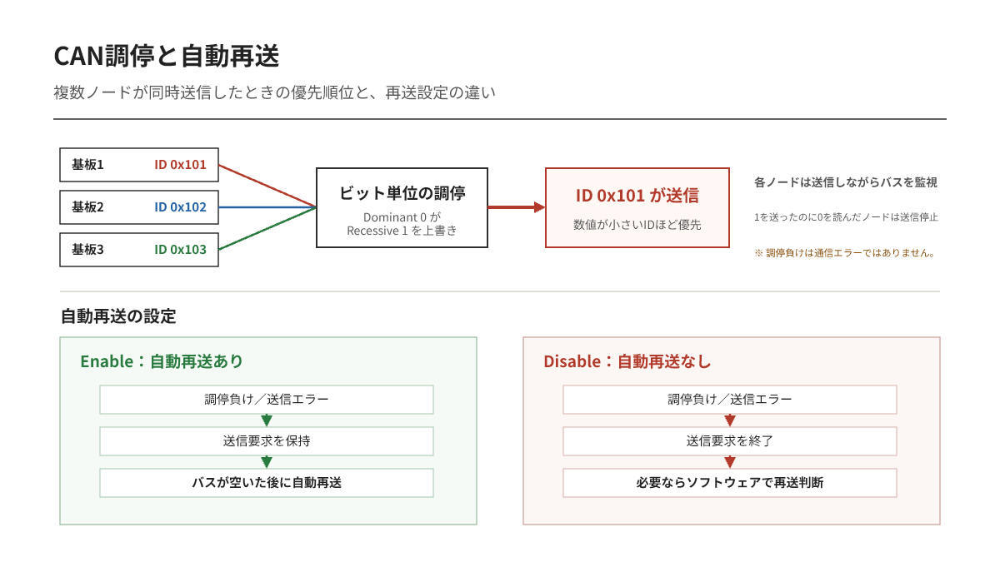
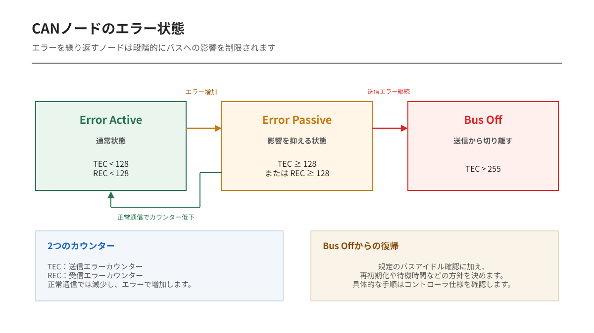

---
tags:
    - CAN
    - 調停
    - エラー処理
    - バスオフ
---

# CAN / CAN FD入門 第4編
## 同時送信と通信エラーをCANはどう処理するか

CANでは、複数ノードが同じ瞬間に送信を始めても構いません。

この自由さは便利ですが、放置すればデータが衝突します。CANはドミナントとレセシブの関係を利用し、送信しながら優先順位を決めます。

## 小さいIDほど優先される理由

CAN IDは最上位ビットから順番に送信されます。0はドミナント、1はレセシブです。

各ノードは、自分が送ったビットと実際のバス状態を比較します。

- 自分が0を送り、バスも0：送信継続
- 自分が1を送り、バスも1：送信継続
- 自分が1を送ったのにバスが0：調停に負けて送信停止

数値の小さいIDは、上位側で0が現れやすいため優先されます。

調停に負けたノードはエラーを発生させません。受信側へ切り替わり、勝ったフレームを見届けます。その後、バスが空けば再び送信を試みます。

優先フレームを壊さないため、**非破壊調停**と呼ばれます。

## 優先度を上げすぎると別の問題が起きる

重要なメッセージへ小さいIDを割り当てるのは正しい設計です。

しかし高優先度フレームの送信周期が短く、バス負荷が高すぎると、低優先度フレームが長時間送れないことがあります。ID設計では重要度だけでなく、周期、許容遅延、データ長、最悪時のバス負荷を合わせて検討します。

「IDが小さいほど速い」のではありません。

送信権を得やすい、という意味です。

## CANが検出する主なエラー

CANコントローラは、通信中に複数の観点でフレームを監視します。

| エラー | 検出内容 |
|---|---|
| Bit error | 送信値とバス上の値が一致しない |
| Stuff error | ビットスタッフィング規則に違反 |
| CRC error | 受信側のCRC計算結果が一致しない |
| Form error | 固定形式のビットが規定値と異なる |
| ACK error | ACKスロットがレセシブのまま |

調停中にレセシブを送ってドミナントを読んだ場合や、ACKスロットで受信ノードがドミナントを返す場合など、正常動作として不一致が起きる場所はBit errorの対象外です。

## エラーが起きたフレームは全員で捨てる

ノードがエラーを検出すると、エラーフラグを送ってフレームを中断させます。他のノードも異常を検出し、そのフレームを破棄します。

送信ノードは、通常、バスが利用可能になった後に再送信します。

これにより「あるノードだけ古い値を受け取り、別のノードだけ新しい値を受け取る」という不一致を減らしています。

ただし、自動再送を無効化できるCANコントローラもあります。再送の有無は、使用するマイコンの設定とシステム要求を確認します。

## 故障ノードがバスを止め続けない仕組み

故障したノードがエラーフラグを出し続けると、正常なノードまで通信できなくなります。

CANコントローラは送信エラーカウンターと受信エラーカウンターを持ち、エラーの蓄積に応じて状態を変えます。

- **Error Active**：通常状態。アクティブエラーフラグを送れる
- **Error Passive**：エラーが多い状態。バスへの影響を抑える
- **Bus Off**：重大な送信異常。バスへの送信から切り離される

Bus Offからの復帰方法は、CANコントローラとソフトウェア設計によって異なります。自動復帰させるのか、一定時間待つのか、電源再投入や診断を要求するのかを決めておく必要があります。

## ACKエラーが続くとき

1台だけでCANを動かしたとき、送信波形は出ているのに送信完了にならないことがあります。

受信ノードが存在しなければ、誰もACKを返しません。送信ノードはACK errorとして扱い、設定によっては同じフレームを繰り返し送信します。

この現象は、トランシーバ故障とは限りません。

- 相手ノードが接続されているか
- 相手とビットレートが一致しているか
- 相手がListen-onlyになっていないか
- CAN_H/CAN_Lが逆でないか
- 終端抵抗が正しいか

まずここを確認します。

## この編の要点

- CANはIDを上位ビットから比較して非破壊調停する
- 数値の小さいIDほど優先度が高い
- エラー検出時はフレームを中断し、全ノードが破棄する
- 送信ノードは通常自動再送するが、設定で無効化できる場合がある
- エラーが蓄積するとError Passive、Bus Offへ移行する

