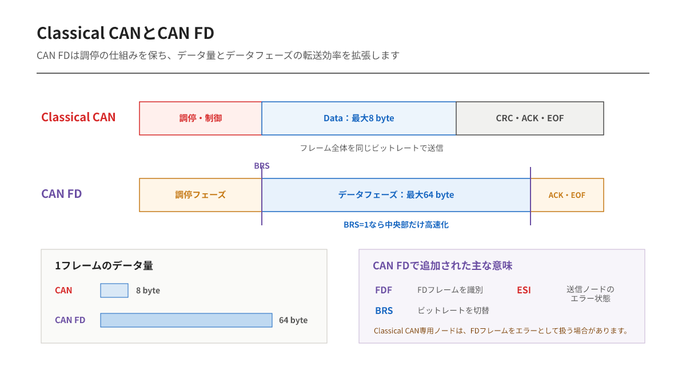

---
tags:
    - 開発資料
    - 有線通信
    - CAN FD
    - CAN
---

# CAN / CAN FD入門 第5編
## CAN FDは何を変え、何を残したのか

Classical CANは信頼性の高い通信ですが、一つのフレームで送れるデータは最大8 byteです。

ソフトウェア更新、診断データ、大きなセンサー情報を扱うと、8 byteごとに分割する回数が増えます。フレームごとにID、CRC、ACKなどが必要になるため、データ以外の部分も増えていきます。

CAN FDは、CANの調停やエラー処理の考え方を残しながら、データ量とデータ部の転送速度を拡張しました。

## Classical CANとCAN FD

| 項目 | Classical CAN | CAN FD |
|---|---|---|
| 1フレームのデータ長 | 0～8 byte | 0～64 byte |
| ビットレート | フレーム内で基本的に一定 | データ部を高速化可能 |
| リモートフレーム | あり | FD形式ではなし |
| CRC | Classical CAN用 | データ長に応じて強化 |
| ID | 11 bit / 29 bit | 11 bit / 29 bit |

CAN FDは常に高速になるわけではありません。

64 byteを使えることと、データフェーズを高速化することは別の機能です。BRSを使わず、ビットレートを切り替えないCAN FDフレームも送信できます。

## 一つのフレーム内に2種類の速さがある

CAN FDでは、フレーム前半の調停を行う領域を**アービトレーションフェーズ**、主にデータを送る領域を**データフェーズ**として扱います。

- アービトレーションフェーズ：すべてのノードが調停できる公称ビットレート
- データフェーズ：必要に応じて高速なデータビットレート

BRS（Bit Rate Switch）が有効な場合、BRS付近からCRC領域の終わり付近まで高速側へ切り替わります。その後、ACKとフレーム終端は公称ビットレートへ戻ります。

調停部分まで高速化しないのは、バス全体で同時送信を安全に比較する必要があるためです。

## CAN FDで追加された主なビット

| ビット | 意味 |
|---|---|
| FDF | Classical CANフレームかCAN FDフレームかを識別 |
| BRS | データフェーズでビットレートを切り替えるか |
| ESI | 送信ノードがError ActiveかError Passiveかを示す |

FDFはフレーム形式を区別します。BRSは速度切替、ESIは送信ノードのエラー状態に関係します。

似た略語が並びますが、役割は別です。

## DLCとデータ長は途中から一致しない

CAN FDのDLCは4 bitのままです。そのため、8 byteを超える領域ではDLC値とデータバイト数を次のように対応させます。

| DLC | データ長 |
|---:|---:|
| 0～8 | 0～8 byte |
| 9 | 12 byte |
| 10 | 16 byte |
| 11 | 20 byte |
| 12 | 24 byte |
| 13 | 32 byte |
| 14 | 48 byte |
| 15 | 64 byte |

例えば10 byteだけ送りたい場合でも、CAN FDフレームのデータ長としては12 byteを選び、未使用部分の扱いを設計します。

## CRCも長くなる

データ領域が大きくなると、破損を検出する仕組みも強化する必要があります。

CAN FDではデータ長に応じて17 bitまたは21 bitのCRCを使用し、スタッフビット数の情報も保護に利用します。初心者がCRC多項式まで暗記する必要はありませんが、Classical CANのフレームへ単純にデータだけ追加した構造ではないことは押さえておくべきです。

## Classical CANノードとの混在

CAN FD対応コントローラは、通常Classical CANフレームも扱えます。

しかしClassical CANだけに対応したノードは、CAN FDフレームを正常なフレームとして解釈できず、エラーフレームを送る場合があります。

したがって、同じバスへCANノードとCAN FDノードを接続できたとしても、そのままCAN FD通信を始められるとは限りません。

- 全ノードがCAN FD対応か
- Classical CANフレームだけを使う期間があるか
- 非対応ノードをSilent状態にできるか
- トランシーバが目標データビットレートに対応するか

システム全体で確認します。

## 高速化すると配線条件は厳しくなる

データビットレートを上げると、支線、コネクタ、基板配線、トランシーバ遅延、リンギングの影響が大きくなります。

「CANで動いた配線だからCAN FDでも動く」とは限りません。CAN FD対応トランシーバを選ぶだけでなく、実配線で波形とサンプルポイントの余裕を確認します。

## この編の要点

- CAN FDは最大64 byteのデータを扱える
- BRSを使うとデータフェーズだけ高速化できる
- FDF、BRS、ESIがCAN FD理解の中心になる
- DLC 9以上は12、16、20、24、32、48、64 byteへ対応する
- Classical CANノードがCAN FDフレームを受信するとエラーになる場合がある

