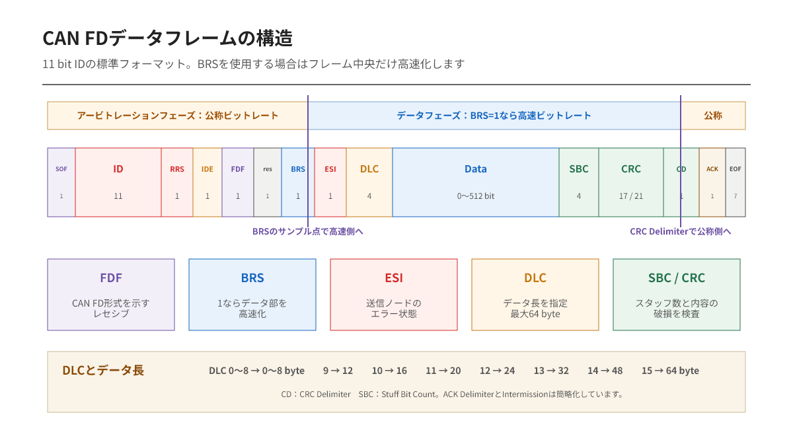

---
tags:
    - 開発資料
    - 有線通信
    - CAN FD
    - CANフレーム
    - CRC
---

# CAN / CAN FD入門 第7編
## CAN FDフレームを分解して読む

CAN FDは「データを64 byteまで増やしたCAN」と説明されることがあります。

それだけなら、Classical CANのデータフィールドを長くすれば済みそうです。しかし実際には、フレーム形式の識別、途中での速度切替、送信ノードのエラー状態、長いデータを守るCRCまで変更されています。

CAN FDフレームは、データが増えただけのCANフレームではありません。

## フレーム前半はClassical CANに近い

フレームはSOFから始まり、11 bitまたは29 bitのIDを送ります。IDはClassical CANと同じく、メッセージの識別と通信調停に使用されます。

標準フォーマットでは、IDの後にRRS、IDE、FDFが続きます。

| フィールド | 主な役割 |
|---|---|
| SOF | フレーム開始と同期 |
| ID | メッセージの識別と優先度 |
| RRS | Classical CANのRTR位置を置き換える固定ビット |
| IDE | 11 bit IDか29 bit IDかを識別 |
| FDF | Classical CANかCAN FDかを識別 |

CAN FDにはFD形式のリモートフレームがありません。そのため、Classical CANでリモート要求に使われたRTR位置はRRSとして扱われ、ドミナントに固定されます。

## FDFがフレーム形式を分ける

FDFはFD Format Indicatorです。

- ドミナント：Classical CANフレーム
- レセシブ：CAN FDフレーム

Classical CAN専用ノードは、このFDF以降をCAN FDの規則で解釈できません。そのためCAN FDフレームを受信すると、フォームエラーなどを検出してエラーフレームを送る場合があります。

CAN FD対応ノードがClassical CANも扱えることと、Classical CAN専用ノードがCAN FDを扱えることは、同じ意味ではありません。

## BRSでビットレートを切り替える

BRSはBit Rate Switchです。

BRSがレセシブの場合、送信ノードと受信ノードはBRSのサンプルポイント付近で高速なデータビットレートへ切り替えます。CRC Delimiterのサンプルポイント付近で、公称ビットレートへ戻ります。

フレーム内には、次の2種類の速度が存在します。

| フェーズ | 使用する速度 | 主な範囲 |
|---|---|---|
| アービトレーションフェーズ | 公称ビットレート | SOF、ID、調停部分、ACK、EOF |
| データフェーズ | データビットレート | ESI、DLC、Data、CRC付近 |

BRSがドミナントなら、CAN FDフレームでも速度を切り替えません。

つまり、CAN FDには次の2通りがあります。

- データ長だけを拡張する
- データ長を拡張し、データフェーズも高速化する

## ESIは送信ノードのエラー状態を示す

ESIはError State Indicatorです。

- ドミナント：送信ノードがError Active
- レセシブ：送信ノードがError Passive

Classical CANフレームには、送信ノードのエラー状態をフレーム内で通知する専用ビットがありませんでした。CAN FDでは、受信ノードがESIから送信側の状態を知ることができます。

ただし、ESIだけで故障原因までは分かりません。Error Passiveへ移行した理由は、コントローラのエラーカウンターや診断情報と合わせて判断します。

## DLCが示す長さ

CAN FDでもDLCは4 bitです。

DLC 0～8はデータ長0～8 byteと一致します。DLC 9以降は、次のように段階的に増えます。

| DLC | データ長 |
|---:|---:|
| 0～8 | 0～8 byte |
| 9 | 12 byte |
| 10 | 16 byte |
| 11 | 20 byte |
| 12 | 24 byte |
| 13 | 32 byte |
| 14 | 48 byte |
| 15 | 64 byte |

9 byte、10 byte、11 byteというCAN FDデータ長は定義されていません。

例えばアプリケーションが10 byteの情報を持っている場合、12 byteのCAN FDフレームを使用し、残り2 byteをパディングする方法などを通信仕様で決めます。

## SBCとCRC

データが長くなれば、破損の検出にも強さが必要です。

CAN FDでは、データ長に応じて17 bitまたは21 bitのCRCを使用します。またSBC（Stuff Bit Count）により、CRC領域より前に挿入されたスタッフビット数の情報も保護します。

| データ長 | CRC |
|---|---|
| 0～16 byte | 17 bit CRC |
| 20～64 byte | 21 bit CRC |

Classical CANのCRCをそのまま延長した構造ではありません。長いデータ領域を扱うため、スタッフビットの扱いを含めて検出機構が強化されています。

## ACKとEOFは公称ビットレートへ戻る

高速なデータフェーズが終わると、ノードは公称ビットレートへ戻ります。その後、正常受信したノードがACKを返し、EOFでフレームを終了します。

ACKの意味はClassical CANと同じです。

少なくとも一つのノードがCRCまで正常に受信したことは分かりますが、目的のノードがアプリケーション処理を完了したことまでは保証しません。

## 波形を見るときの位置関係

オシロスコープやCAN解析器で確認する場合は、次の位置が手掛かりになります。

- ID部分：公称ビットレート
- BRS付近：ビット幅が切り替わる
- Data部分：高速なデータビットレート
- CRC Delimiter付近：公称ビットレートへ戻る
- ACK：受信ノードによるドミナント応答

BRSを有効にしているのにビット幅が変わらない場合は、送信設定、コントローラのFD/BRS許可、ビットタイミングを確認します。

## この編の要点

- FDFはClassical CANとCAN FDを識別する
- BRSはデータフェーズの速度切替を指定する
- ESIは送信ノードのError Active／Passiveを示す
- CAN FDのデータ長は最大64 byte
- DLC 9以降は12、16、20、24、32、48、64 byteへ対応する
- CRCはデータ長に応じて17 bitまたは21 bitになる

CAN FDフレームの中心は、64 byteという数字だけではありません。調停時の互換性を保つ公称ビットレートと、データ転送を効率化する高速ビットレートを、一つのフレーム内で切り替える構造にあります。

## 参考資料

- ベクター・ジャパン株式会社『はじめての CAN / CAN FD』
- [Bosch: CAN FD Protocol](https://www.bosch-semiconductors.com/products/ip-modules/can-protocols/can-fd/)
- [Bosch M_CAN User's Manual](https://www.bosch-semiconductors.com/media/ip_modules/pdf_2/m_can/mcan_users_manual_v331.pdf)
- [CAN in Automation: CAN FD – The basic idea](https://www.can-cia.org/can-knowledge/can-fd-the-basic-idea)

