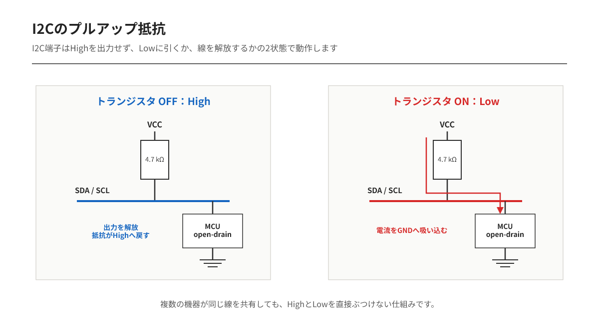

---
tags:
    - 開発資料
    - 有線通信
    - 電子回路
    - 入門
---

# I2Cのプルアップ抵抗の役割と値の決め方

I2Cを初めて使うとき、「SCLとSDAに抵抗を付けるのはなぜ？」と思うことがあります。

I²Cでは、マイコンが信号線をHighへ直接駆動するのではありません。
そのため、プルアップ抵抗がないと正常に通信できません。

## なぜプルアップ抵抗が必要なのか

I2CのSCL・SDAは**オープンドレイン（Open Drain）**という出力方式になっています。

オープンドレインでは、

- LowはマイコンがGNDへ引き下げる
- Highはマイコンから出力しない（開放）

という動作をします。

つまり、誰もHighを出力しないため、プルアップ抵抗で電源へ引き上げる必要があります。



マイコンがLowを出力すると0Vになり、出力を開放すると抵抗によってVCCまで引き上げられます。

## オープンドレインを使う理由

I2Cでは複数のデバイスが同じ信号線を共有します。

もし通常のプッシュプル出力だった場合、

- あるデバイスがHigh
- 別のデバイスがLow

を同時に出力すると、電源とGNDが直結した状態になり、大きな電流が流れてしまいます。

オープンドレインなら、全員がLowしか出力できないため、この問題が起こりません。

## プルアップ抵抗が小さすぎる場合

抵抗値が小さいほどHighになる速度は速くなります。

しかし、Lowを出力したときに大きな電流が流れます。

例えば3.3Vで

```
R = 1kΩ
I = 3.3V / 1kΩ = 3.3mA
```

となります。

抵抗が小さすぎると、

- 消費電流が増える
- デバイスのシンク電流が大きくなる

という欠点があります。

## プルアップ抵抗が大きすぎる場合

抵抗が大きいと充電電流が小さくなります。

そのため配線やICの入力容量を充電するのに時間がかかり、Highへの立ち上がりが遅くなります。

結果として、

- 波形がなまる
- 高速通信でエラーになりやすい

という問題が発生します。

## 抵抗値の計算

I2Cの立ち上がり時間は、プルアップ抵抗とバス容量で決まります。

近似式は

```
t_r ≒ 0.8473 × R × C
```

です。

- `t_r`：立ち上がり時間
- `R`：プルアップ抵抗
- `C`：バス全体の容量

これを変形すると

```
R = t_r / (0.8473 × C)
```

となります。

### 計算例

Fast Mode（400kHz）

- バス容量：100pF
- 最大立ち上がり時間：300ns

の場合

```
R = 300ns / (0.8473 × 100pF)
  ≒ 3.5kΩ
```

実際には規格値から**3.3kΩ**または**4.7kΩ**を選ぶことが多くなります。

この計算値は選定の出発点です。接続するデバイスの許容立ち上がり時間、Low出力時の電流、配線容量を確認し、必要なら実際の波形を測定します。

## 実際によく使われる値

| 通信速度 | よく使われる値 |
|---------|---------------|
| 100kHz | 4.7kΩ～10kΩ |
| 400kHz | 2.2kΩ～4.7kΩ |
| 1MHz | 1kΩ～2.2kΩ |

※配線長や接続するデバイス数によって最適値は変わります。

## まとめ

- I2Cはオープンドレインなので、Highを作るためにプルアップ抵抗が必要
- 抵抗が小さいほど立ち上がりは速いが消費電流が増える
- 抵抗が大きいほど省電力だが立ち上がりが遅くなる
- 一般的な基板では**4.7kΩ**が最もよく使われる
- 高速通信や配線が長い場合は**2.2kΩ～3.3kΩ**程度が選ばれることも多い
