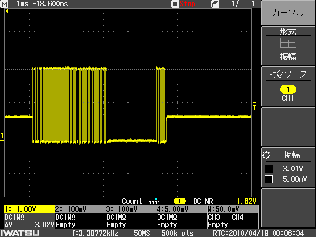
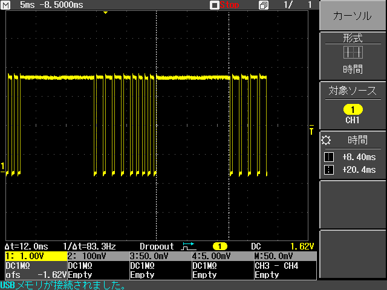

---
tags:
  - Futaba
  - T10J
  - S.BUS
  - メモ
thumbnail:
  targets:
    - other-home
  description: 'T10J背面のS.I/Fポートからスイッチ状態を読み出せるか試したしたメモ'
  order: 1
---

# T10J S.I/Fポートを使ってスイッチ状態を読み出したかった話

T10J背面の `S.I/F` ポートから信号を読み出し、送信機本体のスイッチ状態やチャンネル情報を取得できないか試してみました。

結論として、`S.I/F` ポートから読み出せる情報は限られており、コントローラーの全情報を取得することはできませんでした。  
実用には向かなそうでしたが、調査メモとして残しておきます。

T10JのS.I/Fポートを使ってスイッチ状態を読み出してみたい、という人の参考になればと思います。
（またやる人が出てこないようにという意味合いの方が強いかもしれません。）

> [!CAUTION]
> T10Jの `S.I/F` ポートは、S.BUS系機器の設定用ポートです。  
> 本来このような使い方は想定されていないため、実際に試す場合は自己責任で行ってください。

やりたかったことは、T10Jのスイッチ状態をSTM32で読み出し、IM920などで送信してサブギガ帯でも使えるようにすることでした。

双葉から似た用途のモジュールは出ていますが、高価だったため、自作できないか試してみました。

## S.I/Fポートとは

そもそもこのコネクタって何なの？という話ですが、`S.I/F` は、T10J背面にあるS.BUS系機器用の設定ポートです。

主な用途は、**S.BUSサーボなどの設定を送信機本体から行うためのもの**です。  
送信機本体のスイッチ状態やチャンネル情報を出力するための端子ではありません。

そのため、受信機のS.BUS出力のように、全チャンネルの値をそのまま取得できるとは考えない方がよさそうです。

## 観測した信号

S.I/Fポートの信号をオシロスコープで確認したところ、スイッチ操作に応じて波形が変化することは確認できました。

ただし、通常のS.BUS信号のような高速なシリアル通信ではなく、パルス幅や周期が変化する信号のように見えました。

通常のS.BUSであれば、次のような波形になります。

一方、S.I/Fポートから出力される波形は、スイッチ操作に応じてパルス幅や周期が変化するもので、S.BUSのようにそのままデコードできる信号ではありませんでした。

> 違う実験中のスクリーンショットなので、それぞれスケールはそろっていません。  
> あくまでイメージ程度に見てください。  
> S.BUSの波形も別の実験中のものなので、余計な信号が入っています。

## STM32で読むには

UARTとして読むことは難しそうだったため、STM32の `TIM Input Capture` を使って、パルス幅や周期の変化として読む方法を検討しました。

### TIM Input Captureで読む方法

パルスのエッジ間隔を測定し、スイッチ操作との対応を見る方法です。

@@@text
S.I/F信号
  ↓
TIM Input Capture
  ↓
エッジ間隔を測定
  ↓
スイッチ操作との対応を見る
@@@

この方法で、スイッチ操作による波形変化を解析することはできると思います。

ただし、今回はそこまで実装していません。  
気になったら試してみてください。

## 諦めた理由

S.I/Fポートからは、スイッチ状態やチャンネル情報を完全に取得することはできませんでした。

スティック操作による変化はすべて確認できましたが、スイッチについては `A` 〜 `E` までしか変化が見えませんでした。

採用しなかった主な理由は次の通りです。

- 全チャンネルの値を取得できない
- 得られる信号の意味を特定する資料が少ない
- 一つ一つの波形を解析する必要がある
- スイッチ状態を安定して読む用途には不向き

波形が変化すること自体は確認できても、それを「どのチャンネルの値」として扱えばよいのかが明確ではありません。
(設定されたチャンネルなのか、スイッチ固定なのかなど可能性が広いので、解析が大変です。)

時間がかかりそうな割に得られるものが少ないため、今回はこの方法を諦めました。

## 結論

T10JのS.I/Fポートから、スイッチ状態などの全チャンネル情報を読み出せないか試しましたが、十分なデータは取得できませんでした。

双葉の920MHzモジュールを使うには、そもそもプロポを上位機種に買い替える必要がありそうなので、なかなか難しいところです。

部分的には読み出せるため、S.I/Fポートを使った自作モジュールを作りたくなったときの参考になればと思います。

もう一つ、トレーナーポートがあるので、そちらを使う方法もあるかもしれません。
気になった人はぜひ試してみてください。